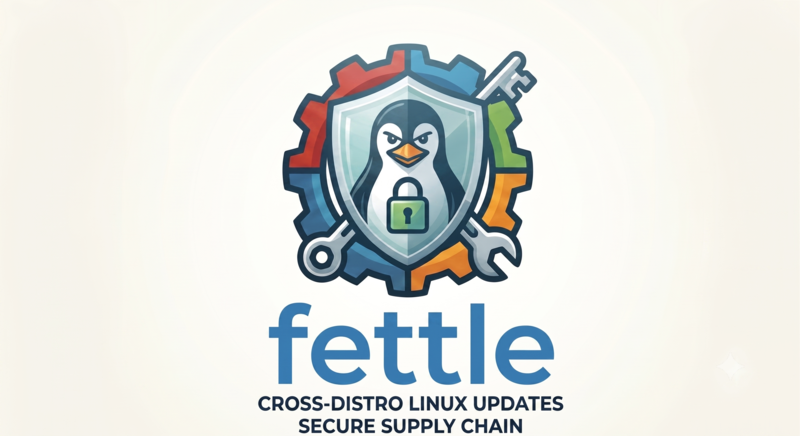

<p align="center">
  
</p>

> # **⚠️ NOTE: THIS IS BETA CODE — USE AT YOUR OWN RISK.**

> *in fine fettle* — in good working order.

**fettle** is a cross-distribution Linux system-maintenance and supply-chain tool.
One command surface keeps your machine updated and clean, audits where your
software came from and whether it has been tampered with, and scans the firmware /
boot chain for security posture — on Arch/Manjaro and Debian/Ubuntu alike.

It is the Python successor to the Arch/Manjaro `update.sh`, `aur-precheck.sh`, and
`supply_chain_check.sh` scripts (from
[`linux_hacks`](https://github.com/pasadoorian/linux_hacks)), rebuilt around a
pluggable per-distro backend so a new distribution is a single new class, and with
real unit-test coverage the bash originals never had.

- **Pure Python standard library** — zero third-party runtime dependencies.
- **Python 3.11+** (uses `tomllib`).
- Nothing to `pip install`: a tiny launcher runs the checked-out repo in place.

---

## Contents

- [What it does](#what-it-does)
- [Supported distributions](#supported-distributions)
- [Requirements](#requirements)
- [Installation](#installation)
- [Quick start](#quick-start)
- [Maintenance actions](#maintenance-actions)
- [Package supply-chain](#package-supply-chain)
- [System supply-chain — `sys-audit`](#system-supply-chain--sys-audit)
- [Remote maintenance](#remote-maintenance)
- [Upgrade Checker (AI)](#upgrade-checker-ai--experimental)
- [Configuration](#configuration)
- [Previewing an upgrade](#previewing-an-upgrade)
- [Common options](#common-options)
- [How elevation works](#how-elevation-works)
- [Architecture](#architecture)
- [Development](#development)
- [fettle vs. topgrade](#fettle-vs-topgrade)
- [Changelog](#changelog)
- [License](#license)

---

## What it does

fettle has three feature families:

1. **Maintenance** — update packages, clean caches, prune orphans, check for
   rebuilds/service-restarts, review config-file drift, report whether automatic
   updates are enabled, apply firmware updates, and manage kernels.
2. **Package Supply Chain** — *where software came from and whether it's tampered*:
   third-party repos/PPAs, publishers, staleness, sandbox permissions, installed-
   file integrity, and (for the AUR) live malware-IOC feeds. Exposed as
   `pkg-audit`, plus the Arch-specific `aur-audit` / `aur-ioc-scan` and the
   install-time yay hook.
3. **System Supply Chain** — *the machine's firmware/boot/hardware posture*:
   Secure Boot, BIOS/UEFI, TPM, Intel ME, CPU microcode, package integrity,
   hardware and storage firmware. Exposed as `sys-audit`, runnable locally or over
   SSH.

The two supply-chain families are deliberately kept distinct in code, docs, and
CLI: "where did this software come from / is it tampered?" → **Package**
(`pkg-audit`); "is the machine's firmware/boot sound?" → **System** (`sys-audit`).

## Supported distributions

| Family | Backend | Package tooling | Detected `ID` / `ID_LIKE` |
|---|---|---|---|
| Arch / Manjaro | `arch` | pacman + yay/pamac + AUR | `arch`, `manjaro`, `endeavouros`, … |
| Debian / Ubuntu | `debian` | apt/nala + flatpak + snap | `debian`, `ubuntu`, `linuxmint`, `pop`, … |

Detection reads `/etc/os-release` and falls through the `ID_LIKE` chain, so
derivatives resolve to their parent family with no extra code. Override with
`--distro <name>` (handy for dry-runs of another backend).

## Requirements

Only **Python 3.11+** and **git** are mandatory. Everything else is optional:
fettle never installs tools — it detects what's present and **skips what's missing
with a note**, so you install only what the commands you actually use need.

### Maintenance

| | Arch / Manjaro | Debian / Ubuntu |
|---|---|---|
| AUR / extras | `yay` or `pamac` | — |
| rebuilds | `rebuild-detector` (`checkrebuild`) | `needrestart` |
| config drift | `pacman-contrib` (`pacdiff`) | (built-in `dpkg`) |
| orphans | (built-in) | `deborphan`, `apt-show-versions` |
| firmware | `fwupd` | `fwupd` |
| kernels | `mhwd-kernel` (Manjaro) | (built-in `dpkg`) |
| flatpak / snap | — | `flatpak`, `snapd` |
| hardening audit (`-H`) | `checksec` | `checksec` |

Every tool above is optional and its check is skipped with a note when absent.
The one you likely need to install is **`checksec`** for the hardening audit:

```sh
sudo pacman -S checksec      # Arch / Manjaro
sudo apt install checksec    # Debian / Ubuntu
```

### `pkg-audit` (package supply-chain)

Nothing extra is *required* — the AUR audit uses only `pacman` + the network, and
the APT/Flatpak/Snap providers read config you already have.

| | Arch / Manjaro | Debian / Ubuntu |
|---|---|---|
| standard | *(none — uses `pacman`)* | `debsums` (file integrity); `flatpak`, `snapd` if you use them |
| manual | *(none)* | *(none)* |

### `sys-audit` (system supply-chain)

**Standard packages** (install what you want covered; missing ones are skipped):

```sh
# Arch / Manjaro
sudo pacman -S --needed mokutil efitools dmidecode inxi lshw pciutils \
    tpm2-tools smartmontools cpuid fwupd pacutils

# Debian / Ubuntu
sudo apt install mokutil efitools dmidecode inxi lshw pciutils \
    tpm2-tools smartmontools cpuid fwupd debsums
```

Which check uses what: `secureboot` → `mokutil`/`efitools` (+ systemd's `bootctl`);
`bios`·`hardware` → `dmidecode`,`inxi`,`lshw`,`pciutils`,`cpuid`; `fwupd` → `fwupd`;
`intel-me` → `pciutils`; `tpm` → `tpm2-tools`,`dmidecode`; `storage` →
`smartmontools`; `packages` → `pacutils` (`paccheck`) on Arch / `debsums` on Ubuntu.

**Manual tools** (not in standard repos — the checks degrade to advice without
them). fettle looks for each under `/opt/<name>/`, `/usr/share/<name>/`, and
`~/<name>/`:

| Check | Tool | Get it |
|---|---|---|
| `firmware` | **chipsec** (`chipsec/chipsec_main.py`) | Arch: AUR `chipsec`; else `git clone https://github.com/chipsec/chipsec` |
| `intel-me` | **Intel CSME Version Detection Tool** (`intel_csme/intel_csme_version_detection_tool`) | download from Intel |
| `tpm` | **tpm-vuln-checker** (`tpm-vuln-checker/tpm-vuln-checker`) | `git clone https://github.com/google/tpm-vuln-checker` |

Example: `git clone https://github.com/google/tpm-vuln-checker ~/tpm-vuln-checker`
puts the tool where the `tpm` check will find it.

## Installation

fettle is pure standard library, so there is nothing to build or `pip install` —
the launcher puts the repo on `PYTHONPATH` and runs `python3 -m fettle`.

```sh
git clone https://github.com/pasadoorian/fettle.git ~/src/fettle
ln -s ~/src/fettle/bin/fettle ~/.local/bin/fettle    # ensure ~/.local/bin is on PATH
fettle --help
```

Update with a plain `git pull`. To drop it in for the old updater:

```sh
ln -sf ~/src/fettle/bin/fettle ~/update.sh
```

### Optional: yay install-time supply-chain hook (Arch/Manjaro)

An advisory, **warn-only** AUR pre-flight that fires at install time — flagging
orphaned / out-of-date / stale packages, known-compromised names, and malicious
maintainers — on top of yay's built-in build-file review. It never blocks an
install.

```sh
cp ~/src/fettle/contrib/yay-init.lua ~/.config/yay/init.lua
```

The hook calls `fettle aur-precheck <pkg>` under the covers; you can run that
directly too.

## Quick start

```sh
fettle                     # run the default maintenance set (auto-elevates)
fettle -a --dry-run        # preview the whole default set; change nothing
fettle -c -u               # clean, then upgrade packages (short flags)
fettle clean update        # identical — every action also works as a bare word
fettle upgrade             # `upgrade` is a synonym for `update`
fettle -O                  # refresh metadata + report upgradable (no upgrade; safe)
fettle -A                  # AUR health audit  -> ~/.fettle/reports/
fettle -P                  # package supply-chain audit -> ~/.fettle/reports/
fettle -S                  # full security scan (sys-audit --all; self-elevates)
fettle -U                  # AI: is this upgrade safe? [experimental] (needs API key)
```

## Maintenance actions

Run with no action to execute the configured default set. Actions can be given as
short flags, long flags, or bare words (`fettle -c -u` == `fettle clean update`).
Anything a distro's backend doesn't support is skipped with a note.

| Flag | Action | Arch | Debian |
|---|---|---|---|
| `-c` | `clean` | pacman + pamac/yay caches (**asks first**; `--yes` skips) | `apt-get clean`/`autoclean`, unused flatpaks, disabled snap revisions (**asks first**) |
| `-o` | `orphans` | foreign pkgs → `~/.fettle/reports/`; remove true orphans (`-Qtdq`) | obsolete pkgs → `~/.fettle/reports/`; `deborphan` + `autoremove` |
| `-u` / `--upgrade` | `update` | pacman/pamac, then yay AUR (with review) | apt/nala, then flatpak, then snap |
| `-O` | `only-update` | refresh metadata **safely** (private cache; no `pacman -Sy`) + report upgradable | `apt update` + flatpak metadata, then report upgradable |
| `-r` | `rebuild-check` | `checkrebuild` (rebuild with `-R`) | `needrestart` (services to restart) |
| `-y` | `python-rebuild-check` *(arch)* | rebuild pkgs stranded on an old `/usr/lib/python3.X` (skips Python interpreters themselves; flags orphaned dirs) | — (apt handles transitions) |
| `-d` | `config-drift` | `pacdiff` `.pacnew` files | `*.dpkg-dist`/`*.dpkg-new`/`*.ucf-dist` + `dpkg --audit` |
| `-x` | `auto-updates` | report enabled auto-update timers (known units) | report `unattended-upgrades` state (`apt-config` + `apt-daily-upgrade.timer`) |
| `-f` | `firmware` | `fwupdmgr` (shared) | `fwupdmgr` (shared) |
| `-k` | `kernel` | `mhwd-kernel` (running series protected; removal is user-named) | `dpkg -l 'linux-image-*'`, purge old (**running AND newest** protected; nudges to reboot if a newer kernel is pending) |
| `-A` | `aur-audit` *(arch)* | AUR health table → `~/.fettle/reports/` | — |
| `-I` | `aur-ioc-scan` *(arch)* | scan installed AUR pkgs for IoCs → `~/.fettle/reports/` | — |
| `-P` | `pkg-audit` | package supply-chain audit → `~/.fettle/reports/` | apt/flatpak/snap provenance |
| `-H` | `hardening-audit` | flag pkgs whose binaries miss the distro's build hardening (needs `checksec`) → `~/.fettle/reports/` | same, via `dpkg-buildflags` baseline |

`update` **asks before upgrading** (the package manager shows its plan and
prompts); pass `--yes` to skip the confirmation and run non-interactively.

Three more flags are **shortcuts to subcommands** (not part of the action
pipeline): `-S` → `sys-audit --all` (security scan), `-U` → `upgrade-check` (AI
advisor), `-p` → `aur-precheck` (AUR pre-flight; bare = scan all installed). Use
the subcommand form for their own options.

**Default set** (run when you pass no action, or `-a`/`--all`): clean, orphans,
update, rebuild-check, python-rebuild-check, config-drift, auto-updates,
firmware-check, and — last, read-only — the security audits **pkg-audit** (`-P`)
and **aur-ioc-scan** (`-I`), so a full run also reports where your packages came
from and whether any installed AUR package matches a known-compromise feed.
Excluded from the default set — request explicitly: `-O`, `-k`, `-A`, `-H`.

`auto-updates` (`-x`) is a **read-only, informational** report of whether the
system is set up to update itself unattended — on Debian/Ubuntu whether
`unattended-upgrades` is installed and its `apt-daily-upgrade.timer` /
`APT::Periodic` knobs are on; on Arch whether a known auto-updater systemd timer
(e.g. `arch-update.timer`, `pacman-auto-update.timer`) is enabled. It states the
fact and offers no opinion; a custom-named Arch timer won't be recognized.

`-R` / `--auto-rebuild` turns the `-r` / `-y` checks from "list" into "offer to
rebuild". Destructive steps (orphan/kernel removal, disabled-snap pruning) always
prompt per item unless you pass `--yes`.

When fettle hands off to a package manager (yay/pacman/apt), it **brackets that
tool's live output in a labeled banner** (`──── yay ──── output below is yay's,
not fettle's ────`) so you can always tell fettle's messages from the tool's.

## Package supply-chain

Four commands touch package provenance/safety and are easy to confuse. Rule of
thumb: **`-P` is the broad, all-ecosystem one; `-A`/`-I`/`-p` are AUR-only and each
answers a different question.**

| Command | What it answers | Use it when | Output |
|---|---|---|---|
| `fettle -P` / `pkg-audit` | Across **all** ecosystems (AUR/APT/Flatpak/Snap): where did my installed software come from, and has it been tampered with? | you want one whole-system supply-chain report | findings → `~/.fettle/reports/` |
| `fettle -A` / `aur-audit` *(arch)* | AUR **health census**: age, votes, out-of-date, orphan, recently-changed, maintainer-change (re-adoption tell) | you want to vet how well-maintained your AUR pkgs are | table → `~/.fettle/reports/` |
| `fettle -I` / `aur-ioc-scan` *(arch)* | AUR **threat sweep**: do any installed AUR pkgs match known-compromise feeds (bad package names, malicious maintainers, malicious JS-cache traces)? | you want a known-compromise check (lenucksi IoC feed) | findings → `~/.fettle/reports/` |
| `fettle -p` / `aur-precheck` *(arch)* | AUR **pre-install / quick sweep**: is this package (or every installed AUR pkg) risky right now — orphaned, out-of-date, stale, compromised name, malicious maintainer? | before building an AUR pkg (the yay hook), or a fast all-installed check | `CRIT`/`WARN` lines |

`pkg-audit` runs each provider whose package manager is present and reports one
normalized `Finding` format with one severity language:

- **AUR** (Arch): orphan / out-of-date / stale / known-bad via AUR RPC + IOC feed.
- **APT** (Debian): third-party repos/PPAs, `[trusted=yes]`, third-party-http,
  `debsums` file integrity.
- **Flatpak**: non-flathub origin, broad sandbox permissions (host/home
  filesystem, `devices=all`), http remotes.
- **Snap**: sideloaded / unverified publisher, `classic`/`devmode` confinement.

Each provider prints a **coverage line** so uneven depth is explicit — a real
malware/IOC feed exists only for the AUR, and fettle never pretends otherwise.

`fettle aur-precheck <pkg>…` is the install-time helper: it prints machine-readable
`CRIT`/`WARN` lines for the named packages and always exits 0. **With no package
named** (`fettle aur-precheck` or `fettle -p`) it scans *every* installed AUR
package instead — a quick safety sweep. Tunable via env vars (`AUR_PRECHECK=false`
to disable, `AUR_PRECHECK_MAX_AGE_DAYS`, `YAY_ALLOWLIST_FILE`, …). The bundled yay
hook (`~/.config/yay/init.lua`) calls it per package before a build — point its
helper at `fettle aur-precheck` (it prefers `fettle` on `PATH`, falling back to the
legacy `aur-precheck.sh`).

How it differs from the others: `aur-precheck` is the fast, self-contained,
env-driven per-package gate (no config/TOML load, silent when clean — built for the
hook); `aur-audit` is the detailed health *report*; `aur-ioc-scan` is the pure
threat/IoC sweep; `pkg-audit` is the cross-ecosystem umbrella that folds AUR
health+IoC in alongside APT/Flatpak/Snap.

### Pre-upgrade gate

**Before `yay -Sua` builds anything**, `fettle -u` / `-a` pre-checks the AUR
packages it's about to upgrade against the IoC feeds — so a flagged package is
caught *before* it's built/installed, not after. On any finding it shows it (a
known-compromised name or malicious maintainer is **loud**; orphan/out-of-date/
stale are warnings) and **prompts to continue or abort** (default: abort). A clean
set just prints a one-line "no indicators" and proceeds.

Because it runs in the update path, it applies to **`fettle remote <host> -u/-a`**
too (the prompt comes over the `ssh -t` session). Under `--yes` a **CRITICAL**
finding still aborts unattended — pass `--force-aur` to override; `--no-aur-precheck`
(or `aur_precheck_on_update = false` in config) turns the gate off. It covers the
`yay -Qua` upgrade set; `--devel`/`-git` rebuilds that don't bump a version stay
covered by the yay hook and the post-update `aur-ioc-scan`.

### Binary hardening audit — `-H` / `hardening-audit`

**In plain terms:** when a program is compiled it can be given built-in *safety
features* — protections that don't change what it does, but that make a bug much
harder for an attacker to turn into a break-in. Your distro publishes a "building
code" of features every program it ships should have. `fettle -H` is the building
inspector: it walks every installed program and lists the ones built *without* the
safety features their neighbours all have — and which package they came from. Most
findings are harmless; the ones that matter are high-privilege or network-facing
programs missing a protection. It's a "why is this one different?" signal, not a
"you've been hacked" alarm.

The rest of this section is the technical detail behind that.

`fettle -H` asks a supply-chain question the other checks don't: **were the
installed binaries actually built with the hardening the distro says it uses?** It
runs [`checksec`](https://github.com/slimm609/checksec) over your executables and
compares each against a baseline *derived from the distro's own build policy* —
not a generic wishlist. On Arch that baseline is `makepkg.conf` **plus GCC's
compiled-in defaults** (`--enable-default-pie`/`--enable-default-ssp` supply PIE
and the stack canary, which `makepkg.conf`'s `CFLAGS` never mention); on
Debian/Ubuntu it's `dpkg-buildflags`. A deviation therefore means a package
escaped the distro's build policy — an upstream Makefile clobbering `CFLAGS`, a
vendored prebuilt binary, or a sloppy AUR build. Findings are rolled up **per
package** and saved to `~/.fettle/reports/`.

**Scope:** every ELF executable in the standard `bin` dirs plus every setuid/setgid
binary (paths are `realpath`-deduped so a merged-`/usr` layout isn't scanned
twice). It needs no root. It's **opt-in** (not in the default `-a` set) because the
list is long and mostly informational — the signal is the *outlier* (a setuid or
network-facing binary missing RELRO/canary), not the bulk.

**What it can and can't see.** checksec infers hardening from ELF structure, so:
detectable = PIE, NX, RELRO (full/partial), stack canary, `_FORTIFY_SOURCE`
*presence*, CET/IBT, RPATH/RUNPATH. **Not** detectable = `-fstack-clash-protection`,
the FORTIFY *level* (2 vs 3), `-Werror=format-security`. Four accuracy corrections
are always applied (they fix wrong data, and are *not* user-tunable): non-ELF files
are skipped (checksec otherwise "fails" every check on a shell/Perl script); static
Go/Rust binaries are skipped (symbol-based checks are meaningless there);
`_FORTIFY_SOURCE=No` is ignored when nothing was fortifiable; and `stack_clash` is
never treated as pass/fail (its "No Probes" just means the binary needed none).

**Reading the output.** Results are **scored and ranked**, worst first. The
on-screen table shows only the **Critical** and **High** packages (the ones worth
acting on); Medium/Low collapse into a one-line tally and the *full* per-criterion
matrix is written to `~/.fettle/reports/`.

```
BAND      SCORE  P  PACKAGE           BINS  MISSING (worst-weighted first)
Critical     18  !  xorg-server          2  canary=2, relro=2
High         10     containerd           3  canary=2, relro=3, fortify_source=3, pie=3
High          9  !  xf86-video-intel     2  relro=2
… plus 131 Medium, 95 Low package(s) — full list in the saved matrix
✓ 1 Critical, 6 High, 131 Medium, 95 Low  (813 deviations across 233 packages)
```

Each row is a package; a package **not** listed conforms fully. `BINS` is how many
of its binaries deviate, `MISSING` names the absent protections (heaviest-weighted
first, with counts), and **`P = !`** marks a **privilege boundary** — a
setuid/setgid binary or one in your `sensitive_packages` list.

**The score** is `Σ weight(missing protection) × privilege-multiplier`, computed
per binary; a package takes its **worst** binary's score. Defaults: canary 3,
relro 3, pie 2, fortify 2, cfi 1, rpath 1, runpath 0.5; ×3 when privileged. Bands:
**Critical ≥ 14 · High ≥ 8 · Medium ≥ 3 · Low < 3**. Because the score already
folds in *how bad* the missing protection is and *whether the binary is
privileged*, the ranking does your triage for you — the Critical/High rows are the
outliers that matter, not the bulk. What each protection defends, heaviest first:

| Criterion | Good value | Protects against | Missing means |
|---|---|---|---|
| `canary` | `Canary Found` | stack buffer overflows | no tripwire before the return address — a classic stack smash is easier |
| `relro` | `Full RELRO` | GOT-overwrite attacks | function-pointer tables stay writable (a common exploit primitive) |
| `pie` | `PIE Enabled` | predictable code addresses | loads at a fixed address, weakening ASLR (ROP is easier) |
| `fortify_source` | `Yes` | unsafe libc calls (`strcpy`…) | no compile-time bounds checks on those wrappers |
| `cfi` | `SHSTK & IBT` | ROP/JOP hijacking | no hardware shadow-stack / indirect-branch tracking |
| `nx` | `NX enabled` | code injection | a writable memory page could also be executable |
| `rpath` / `runpath` | `No RPATH` | malicious library loading | a baked-in library search path an attacker could plant a `.so` in |

**Tuning.** Everything below ships with sensible defaults; add a `[hardening]`
block to your config to adjust. Exclude lists (globs) prune the report; the
scoring keys re-weight it. `sensitive_packages` is how you tell fettle a network
daemon is a privilege boundary (setuid/setgid is detected automatically):

```toml
[hardening]
# prune — fettle reports how many findings your excludes hid
exclude_checks     = ["runpath", "cfi"]                  # criteria you don't care about
exclude_packages   = ["mingw-w64-*", "*-linux-gnu-gcc"]  # e.g. cross-compilers
exclude_paths      = ["/usr/lib/electron*/*"]
# score — all optional
sensitive_packages = ["openssh", "nginx", "cups", "avahi"]  # treat as privilege boundaries
priv_multiplier    = 3
weights            = { canary = 3, relro = 3, pie = 2, fortify_source = 2 }
```

A deviation means the binary was built *differently from the distro norm* — the
score tells you *where to look*, not that anything is exploitable.

## System supply-chain — `sys-audit`

A port of the Eclypsium firmware/boot-chain cheat-sheet. Most checks need root, so
`sys-audit` **elevates itself** (prompting for sudo) — just run `fettle sys-audit`,
**no `sudo` prefix needed**. Pass `--user` to stay unprivileged (partial results).

```sh
fettle sys-audit --list              # list categories (no elevation)
fettle sys-audit --all               # run everything (prompts for sudo)
fettle sys-audit secureboot tpm      # run specific categories
fettle sys-audit -v microcode        # verbose (raw tool output)
fettle sys-audit --user hardware     # run as your user, no sudo
```

Like the other checks, a local scan saves a report to
`~/.fettle/reports/<host>/sys-audit-<ts>.{txt,json}`, so it appears in
`fettle report` (see [HTML report](#html-report--fettle-report-beta)); a
`sys-audit remote <host>` scan fetches its report back to the controller. Run with
sudo/`--all` for the fullest results — many checks only produce real output as root.

> **`sudo: fettle: command not found`?** Don't prefix `sudo` — `fettle` lives in
> `~/.local/bin`, which isn't on root's `PATH`. fettle elevates itself, so plain
> `fettle sys-audit …` works. (If you *want* `sudo fettle` to work, also symlink it
> onto a system path: `sudo ln -sf ~/src/fettle/bin/fettle /usr/local/bin/fettle`.)

| Category | Checks |
|---|---|
| `secureboot` | Secure Boot state + the **2026 Microsoft cert-expiry matrix** (2011 vs 2023 KEK/db certs, migration status) |
| `bios` | BIOS/UEFI vendor, version, date; motherboard info |
| `firmware` | chipsec — Intel ME manufacturing mode, BIOS write-protection (needs chipsec + root) |
| `fwupd` | firmware devices, available updates, HSI security attributes |
| `intel-me` | MEI device, ME firmware version, ME PCI controller |
| `microcode` | CPU microcode revision + `/sys` vulnerability mitigations |
| `tpm` | TPM device, version, DMI info, TPM2 capabilities |
| `packages` | installed-file integrity (`paccheck`/`pacman -Qkk`, or `debsums`/`dpkg --verify`) |
| `hardware` | inxi/lspci hardware inventory, memory modules |
| `storage` | per-device model / firmware / serial via `smartctl` |

### Remote scanning

Scan a host over SSH without installing anything on it. fettle builds a single-file
**zipapp** of itself (pure stdlib → runs under any `python3`), `scp`s it to the
target, runs it over `ssh -t`, and cleans up — preserving the remote exit code.
The target only needs a `python3` interpreter; the scanner doesn't read the TOML
config, so it runs fine on older Pythons (e.g. Ubuntu 22.04's 3.10, which has no
`tomllib`).

```sh
fettle sys-audit remote server1 all               # host from ~/.ssh/config
fettle sys-audit remote --sudo admin@host2 tpm    # prompt once for remote sudo
fettle sys-audit remote -v gateway secureboot     # -v forwarded to the remote run
```

## Remote maintenance

Run **any** action on another host over SSH — same zipapp transport as the scanner
(nothing installed on the target; it just needs `python3` and the same fettle
version). The grammar is:

```
fettle remote [--ssh-arg ARG]... HOST [any fettle action/flags...]
```

Everything after `HOST` is forwarded verbatim to fettle on the remote, so the full
CLI works remotely. Changes are wrapped in `sudo` (the remote fettle runs as root);
a `--dry-run` needs neither sudo nor a password.

```sh
fettle remote server1                  # safe default: clean + update + firmware-check
fettle remote server1 -c -u            # clean, then upgrade packages
fettle remote server1 update --dry-run # preview an update; changes nothing
fettle remote server1 -a --yes         # the full default set, unattended
fettle remote server1 -S               # security scan on the host (sys-audit --all)
fettle remote server1 upgrade-check    # AI pre-upgrade check (analysed on YOUR box)
fettle remote server1 orphans kernel   # destructive actions run only when named
fettle remote --ssh-arg=-oConnectTimeout=5 server1 -u
```

- **Safe by default.** `fettle remote <host>` with **no action named** runs only
  `clean update firmware-check` — even with `--yes`. Destructive/interactive
  actions (**orphan** and **kernel** removal) run **only when you name them**; `-a`
  forwards through and runs the remote's full default set.
- **`upgrade-check` (`-U`) analyses locally.** `fettle remote <host> upgrade-check`
  is special: fettle collects a (redacted) snapshot on the remote — **read-only, no
  sudo, no API key** — and runs the AI analysis **on your machine** with your local
  key. Your key never leaves your machine, only your machine needs internet to
  Anthropic, and the report is saved locally as `~/.fettle/reports/<host>/`. (On
  Debian the remote's pending list is read from cached apt data, so it may be stale
  if the host hasn't `apt update`d recently; Arch uses a fresh rootless sync.)
- **Asks before upgrading.** By default the run is interactive over an `ssh -t`
  TTY: the remote package manager shows its plan and prompts before upgrading (and
  sudo prompts for a password if needed). This is the same locally — `fettle -u`
  asks; it does **not** auto-upgrade.
- **`--yes` = fully unattended.** No prompts at all: `pacman --noconfirm` /
  `apt-get … --force-confold full-upgrade -y` (keeps old conffiles), no TTY. It
  assumes **passwordless sudo** on the target, and on Arch it **skips yay's
  PKGBUILD review** — only use it on hosts whose sources you trust.

> After an unattended (`--yes`) run, review kept config files with
> `fettle remote <host> config-drift` (apt keeps the old file and drops a
> `.dpkg-dist`; pacman leaves a `.pacnew`).

### Host groups

Define a **group** of hosts in the config and run on all of them, in order, with
one command — e.g. update the whole lab:

```toml
# ~/.config/fettle/config.toml
[remote.groups.bifrost-lab]
hosts    = ["bifrost", "ec1", "ec2", "ec3"]   # ~/.ssh/config aliases, hostnames, or IPs
# actions  = ["-a"]        # optional: default action(s) when none given on the CLI
# ssh_args = ["-o", "ConnectTimeout=5"]   # optional: merged with any CLI --ssh-arg
# yes      = true          # optional: always run unattended

[remote.groups]            # shorthand — a bare list is {hosts = [...]}
arch-boxes = ["mjolnir", "wopr"]
```

```sh
fettle remote bifrost-lab -a          # run `fettle -a` on each host, in order
fettle remote bifrost-lab -a --yes    # unattended (no confirm; needs passwordless sudo)
```

`fettle remote <group>` runs the same per-host flow (including the report
fetch-back to `~/.fettle/reports/<host>/`) on each host **sequentially**. It
**confirms the host list** before starting (skipped under `--yes` / `--dry-run`),
**continues past a host that fails**, and prints a **pass/fail summary** at the end
(the command exits non-zero if any host failed). A group name takes precedence over
a same-named single host; an unknown name is treated as a single host. One group
(or host) per command.

> For a truly walk-away group run, use `--yes` (or `yes = true`) **and** set up
> **passwordless sudo** (`NOPASSWD`) on the group's hosts — otherwise each host
> stops for its sudo password over the interactive `ssh -t`.

A standalone binary (for hosts with no `python3` at all) is a planned option; the
zipapp is the current transport. It's uploaded to the remote user's home under a
random name (not a predictable world-writable `/tmp` path) and removed after the run.

## Upgrade Checker (AI) — experimental

> ⚠️ **Experimental / under active testing.** This feature is still being validated
> across VMs and distros. Treat its advice as a **second opinion**, not a guarantee —
> read the cited forum threads and use your own judgment before upgrading.

`fettle upgrade-check` asks **Claude** whether a pending upgrade is safe *before*
you run it. It collects the packages that would upgrade plus a hardware/software
profile (`inxi`), has Claude research the distro's forums (Arch BBS, Manjaro,
Ubuntu Forums, Launchpad) for known issues, and returns a clean, cited verdict with concrete
before/after steps. It is **report-only** — it never touches your system; you run
`fettle -u` yourself once you're satisfied.

```sh
export ANTHROPIC_API_KEY=sk-ant-…
fettle upgrade-check                 # verdict + steps -> ~/.fettle/reports/
fettle upgrade-check --effort high   # deeper analysis for a big/risky upgrade
fettle upgrade-check --no-web        # skip forum search (faster, cheaper)
fettle remote HOST upgrade-check     # check a remote host — key stays on YOUR box
```

For a remote host, fettle gathers the snapshot **on the host** (read-only, no key)
and runs the AI analysis **locally** with your key, saving `~/.fettle/reports/<host>/`
— see [Remote maintenance](#remote-maintenance).

- **API key** (first found wins): `ANTHROPIC_API_KEY` env → `ai_api_key` in the
  config. Prefer the env var. If you put the key in the config, **`chmod 600` it
  yourself** — fettle refuses a world-*writable* config but does **not** reject a
  world-*readable* one, so a default `644` file leaks the key to other local
  users. No key → it just prints the pending-package list. `--print-config`
  **never** prints the key in full — only a `sk-ant-…1234` hint and its source.
- **Privacy:** hardware **serials, MAC addresses, and UUIDs are stripped** from the
  inxi output before anything is sent; only the redacted profile + package list
  reach the API.
- **Grounded, not guessed:** the model is given the real package list and told to
  cite a forum source for every claim (and to call the upgrade routine when it
  finds nothing). fettle then **drops any flagged package that isn't actually
  upgrading** and any source outside the trusted forums — so the report can't warn
  you about things that aren't in your update.
- **Cost & controls:** one request per run — `claude-sonnet-5` at `effort=medium`,
  forum searches capped at `ai_max_web_searches` (default 5). Roughly
  **$0.10–0.30 for a small upgrade**, up to **~$0.60 for a large batch** (a
  330-package Ubuntu run with 5 web searches was ~186k input / 7k output tokens),
  since the fetched forum pages ride in the input. The exact token + search count
  prints at the end. Tune via config (`ai_model`, `ai_effort`,
  `ai_max_web_searches`), `--effort`, or `--no-web` (cheapest — skips the forum
  search entirely).

Pure stdlib, like everything else — the API is called over `urllib`, no
`anthropic` SDK to install (which also means no `pip`/venv friction on Arch).

## Configuration

Optional TOML file at `~/.config/fettle/config.toml`. Precedence, low → high:
**built-in defaults < config file < command-line flags**. fettle refuses to read a
config that is world-**writable** or owned by someone other than you or root — it
does **not** reject a world-**readable** one, so `chmod 600` it yourself if it
holds a secret. Action names accept hyphens or underscores.

```toml
# ~/.config/fettle/config.toml  (all keys optional; values shown are the defaults)

default_actions = ["clean", "orphans", "update", "rebuild-check", "python-rebuild-check", "config-drift", "firmware-check", "pkg-audit", "aur-ioc-scan"]
auto_rebuild    = false
exclude_foreign = ["brave-bin", "google-chrome"]   # names or globs; skip in reports
keep_orphans    = ["downgrade", "nvchecker"]        # never offer these for removal

# AUR supply-chain
aur_max_age_days  = 365    # PKGBUILD older than this is "stale" (pkg-audit)
aur_recent_days   = 21     # -A flags packages changed within this window
aur_ioc_campaigns = ["aur-infected", "chaos-rat", "russian-spam"]
aur_ioc_cache_ttl = 21600  # seconds to cache IOC feeds on disk
aur_precheck_on_update = true  # IoC-check AUR pkgs before yay builds them (--no-aur-precheck skips)

# Upgrade Checker (fettle upgrade-check) [experimental] — prefer ANTHROPIC_API_KEY env var
ai_model            = "claude-sonnet-5"
ai_effort           = "medium"   # low | medium | high — thinking depth vs cost
ai_max_web_searches = 5          # cap forum searches per run (bounds tokens/cost)
# ai_api_key = "sk-ant-..."      # optional; keep the file chmod 600; never printed in full

# Reports & run logs (stored under ~/.fettle/, per host, 0600)
[reports]
keep = 5                 # how many of each report/log to keep per host
# dir = "~/.fettle"      # base dir override (reports/ and logs/ live under it)
# log = true             # record a per-run transcript (set false to disable)

# Per-distro tool selection
[updaters.arch]
system_updater = "pacman"   # pacman | pamac
aur_updater    = "yay"      # yay | pamac | none

[updaters.debian]
system_updater  = "apt"      # apt | nala | none
flatpak_updater = "flatpak"  # flatpak | none
snap_updater    = "snap"     # snap | none
```

`fettle --print-config` shows the effective configuration; `--config PATH` points
at an alternate file; `--no-config` ignores it entirely. A starter template ships
as [`fettle.toml.example`](fettle.toml.example).

### Reports & run logs

Every report (`aur-audit`, `pkg-audit`, `hardening-audit`, `upgrade-check`, the
orphans list, …) is written under **`~/.fettle/reports/<host>/`**, timestamped so
runs never clobber each other, `chmod 0600` (they name your packages and can hold
system detail), and rotated to the newest **`keep`** (default 5) *per host, per
report type*. `<host>` is `local` for a local run or the target hostname for
`fettle remote <host> …`, so each machine keeps its own history. (Pre-0.11 reports
in `$HOME` are left untouched; fettle notes the move once.)

Every invocation is also **recorded to a transcript** under
`~/.fettle/logs/<host>/run-<timestamp>.txt` (same `0600` + rotation). On an
interactive terminal fettle captures the *whole* session — its own output **and**
every tool it runs (yay/pacman/apt) — the way `script(1)` does: it re-execs itself
once under a pseudo-terminal, so the actual run happens on a **real tty** and
colours, progress bars, and `sudo`/PKGBUILD prompts behave exactly as normal. The
saved log is ANSI-stripped for readability. When output is piped or non-interactive
there's no terminal to record, so the log captures fettle's own output only.

> The one-time re-exec is transparent, but if you're debugging startup or wrapping
> fettle in another tool and want it off, set `log = false` under `[reports]`.

**JSON siblings.** Every report and log is also written as a structured
`<name>-<timestamp>.json` beside the `.txt` — a `{schema, tool, host, timestamp,
fettle_version, data}` envelope whose `data` is the real structure (scored
hardening packages, findings with severity, the upgrade-check result, package
lists, log transcript). Same `0600`, rotated as a unit with the `.txt`. Turn it off
with `json = false` under `[reports]`.

### HTML report — `fettle report` *(beta)*

`fettle report` regenerates a single self-contained **`~/.fettle/report.html`**
(`0600`) from all the stored JSON, across **every host**: a per-host summary card
row (latest hardening band tally, per-type counts, latest run), collapsible
sections grouped by report type with native rendering — scored hardening tables,
severity-coloured findings, upgrade verdicts, package lists, `sys-audit`
firmware/boot/hardware results (status levels + a raw-output section), log
transcripts — and a host/type/text filter. Empty reports are hidden (with a
per-host "N hidden"
note). It's styled as a dark Linux terminal (monospace, phosphor palette). Pure
stdlib, no external assets, nothing served.

```sh
fettle report                 # (re)build ~/.fettle/report.html
fettle report --open          # …and open it in a browser
fettle report --backfill-json # one-off: give pre-0.12 .txt reports a JSON sibling first
```

> **This is an initial (beta) revision** — the layout and contents will evolve.
> It reads whatever JSON is currently retained (the `keep` window), so run it after
> your scans; for older text-only reports, run `--backfill-json` once.

## Previewing an upgrade

`fettle -u --dry-run` resolves and lists **every package the upgrade would
install** — version upgrades, the new dependencies they pull in, and any
removals — grouped by source, before it prints the commands it would run. It
changes nothing and needs no `sudo`.

```
▸ [1/1] Updating packages
  14 package(s) would be installed/changed:
    official repos (12):
      linux              6.12.1-1 -> 6.12.4-1
      systemd            257.2-1  -> 257.3-1
      + libfoo           2.0-1                 (new dependency)
      - obsolete-lib     1.2-3                 (remove)
      …
    AUR (2):
      brave-bin          1:1.92.134-1 -> 1:1.92.138-1
  would run: pacman -Syuu
  …
```

On Arch this uses `checkupdates`' trick — a throwaway package DB synced in `/tmp`
via `fakeroot` — so the preview reflects **fresh** mirror data without touching
your system DB or needing root (`pacman-contrib` + `fakeroot` recommended; it
degrades to cached data with a note otherwise). On Debian/Ubuntu it's apt's
native `apt-get -s dist-upgrade` simulation. Pass `--no-sync` to skip the refresh
and preview against the cached data (faster; may be stale). AUR `-git`/`-devel`
packages that rebuild from source may not show a version bump until yay fetches
them — noted in the output.

## Common options

| Option | Effect |
|---|---|
| `-a`, `--all` | run the default action set |
| `--dry-run` | print what would run; execute nothing (read-only queries still run) |
| `--no-sync` | dry-run preview: use cached repo data instead of a fresh sync |
| `--only ACTION` / `--skip ACTION` | restrict / exclude actions (repeatable) |
| `--yes` | assume yes to all prompts (non-interactive) |
| `--no-aur-precheck` | skip the pre-upgrade AUR IoC gate *(arch)* |
| `--force-aur` | with `--yes`, install AUR pkgs despite a CRITICAL pre-check finding *(arch)* |
| `-R`, `--auto-rebuild` | offer to rebuild instead of only listing (with `-r`/`-y`) |
| `-v` / `-q` / `--no-color` | verbose / quiet / disable color (also honors `NO_COLOR`) |
| `--distro NAME` | override distro detection |
| `--print-config` / `--version` | print config or version and exit |

## How elevation works

fettle elevates **lazily and by itself** — you never need to type `sudo fettle`.

- **Maintenance actions** re-exec under `sudo` only when a selected action will
  actually change the system. Read-only work — `pkg-audit` (`-P`), `aur-audit`
  (`-A`), `aur-ioc-scan` (`-I`), `config-drift` (`-d`) — runs unprivileged and
  never prompts. `--dry-run` never elevates.
- **`sys-audit`** elevates itself too (most checks need root); pass `--user` to
  stay unprivileged. `--list` and `remote` don't elevate.

Because elevation re-execs the full `python3 -m fettle` path (not the `fettle`
name), it works even though the launcher in `~/.local/bin` isn't on root's `PATH`
— which is why `sudo fettle …` is unnecessary (and fails with *command not found*
unless you also install to a system path).

Your config path is carried across the re-exec, so your `keep_orphans`,
`exclude_foreign`, and `[updaters]` settings are honored on elevated runs too
(`sudo` resets `HOME` to `/root`, so without this the elevated process would
quietly fall back to built-in defaults).

## Architecture

- **One backend per distro family** (`fettle/backends/*.py`) implementing a shared
  `PackageBackend` ABC; a backend advertises the actions it supports, and the CLI
  hides the rest. Adding a distro is one subclass + one registry line — never a
  new script.
- **Curated command allowlist** per backend: config tunes *behavior* (skip
  flatpak, pick nala), it never *discovers* new commands to run.
- **Normalized supply-chain model** (`fettle/supplychain/`): one `Finding` format
  and one seven-question set; each source provider answers what its ecosystem can
  and states its coverage.
- **Mockable seams**: all command execution goes through one `run()` wrapper, and
  the `sys-audit` checks read `/sys`·`/proc`·`/dev` through an injectable `root` —
  so the whole thing is unit-tested with no root and no real hardware.
- **Everything routes through one output layer** (`fettle/output.py`) for a single
  color / verbosity / summary language.

## Development

```sh
python -m venv venv && source venv/bin/activate
pip install -e '.[dev]'      # pytest + ruff (dev-only; runtime stays pure-stdlib)
pytest -q                    # full unit suite
ruff check fettle/ tests/    # lint
```

Tests mock external commands via `unittest.mock.patch("subprocess.run", …)` and
fake `/sys`·`/proc` trees with a `tmp_path` root, so they need neither root nor
special hardware. Runtime code never imports pytest — the shipped tool is
pure standard library.

## fettle vs. topgrade

[topgrade](https://github.com/topgrade-rs/topgrade) is the closest widely-used
tool, and fettle's design was informed by it — so here's an honest comparison.
**They aim at different problems.** topgrade is a broad, cross-platform *upgrade
orchestrator*: it detects the tools you use and runs all of them. fettle is a
focused Arch/Debian *maintenance **and** supply-chain-security* tool with a small,
curated command set.

| | topgrade | fettle |
|---|---|---|
| Platforms | Linux, macOS, Windows, BSD | Arch/Manjaro + Debian/Ubuntu families only |
| Integrations | ~60+ across many ecosystems | curated: pacman/apt (+ yay/pamac/nala), flatpak, snap, fwupd, kernels, AUR |
| Language toolchains (pip/npm/cargo/gem…), editors, dotfiles, git repos | ✅ updates them | ❌ deliberately out of scope |
| Tool selection | auto-detects installed tools | explicit per-distro allowlist — config tunes behaviour, never *discovers* commands |
| Self-update | ✅ | ❌ by design (your package manager owns fettle) |
| Skip / run-only specific steps | ✅ | ✅ (`--skip` / `--only`) |
| Dry-run | ✅ | ✅ — plus a full **resolved transaction preview** (upgrades + new deps + removals) |
| Asks before upgrading | mostly unattended | ✅ by default (`--yes` for unattended) |
| Remote over SSH | ✅ run topgrade on remote hosts | ✅ any action over ssh, **plus** remote security scan and remote AI upgrade-check |
| Config | TOML | one flat TOML + a safety gate (refuses world-writable / wrong-owner) |
| Firmware updates (fwupd) | ✅ | ✅ |
| Auto-update posture report (is the system set to auto-update itself?) | ❌ (runs upgrades; doesn't report update config) | ✅ `auto-updates` (`-x`) |
| End-of-run summary | ✅ | ✅ (+ next steps) |
| Runtime | single Rust binary | pure Python standard library (any `python3`; no `pip`) |
| Maturity / ecosystem | established, widely packaged, large community | young (v0.13.0, beta), two distro families |
| **Package provenance / tamper audit** (AUR/APT/Flatpak/Snap) | ❌ | ✅ `pkg-audit` |
| **Binary build-hardening audit** (did packages escape the distro's build flags?) | ❌ | ✅ `hardening-audit` (`-H`, via checksec) |
| **Firmware / boot security scan** (Secure Boot, TPM, microcode, chipsec…) | ❌ | ✅ `sys-audit` |
| **AUR IoC scan + install-time pre-flight** | ❌ | ✅ `aur-ioc-scan`, `aur-precheck` |
| **Package-file integrity verification** | ❌ | ✅ via `sys-audit` (paccheck / debsums) |
| **AI pre-upgrade advisor** | ❌ | ✅ `upgrade-check` (local **and** remote) |

**Which should you use?**

- **topgrade** if you want one command to update *everything, everywhere* — system
  packages, language toolchains, editors, containers, dotfiles — with a huge,
  battle-tested integration set across every major OS.
- **fettle** if you're on Arch or Debian and want maintenance **with a security
  lens**: know where your packages came from and whether they've been tampered
  with, scan your firmware/boot posture, and get an AI second opinion before a big
  upgrade — through a small, curated, auditable command set with no runtime deps.

They're **complementary** — it's reasonable to run topgrade for breadth and fettle
for the Linux provenance / security / firmware angle. Several of fettle's
deliberate *non-goals* (no self-update, no auto-discovery of commands, no
cascading config) are lessons taken from topgrade's rough edges — not a knock on a
tool that does far more, on far more platforms, than fettle aims to.

<sub>topgrade details summarized from its README and `config.example.toml`, July 2026.</sub>

## Changelog

See [CHANGELOG.md](CHANGELOG.md) for the full, versioned history.

## License

[MIT](LICENSE).
