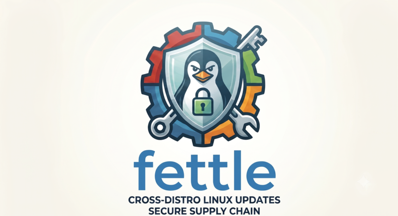

<p align="center">
  
</p>

> # **⚠️ NOTE: THIS IS BETA CODE — USE AT YOUR OWN RISK.**
>
> **The 0.5.x line is undergoing a full feature-by-feature QA pass. Use with caution.**
> Every action is being tested against seven live systems — Arch, Manjaro, Debian,
> Ubuntu, Rocky, AlmaLinux and Fedora — and fixed where it misbehaves or explains itself
> badly. That work is landing continuously in 0.5.x, so **behaviour can change between
> releases**: read [CHANGELOG.md](CHANGELOG.md) before upgrading, and check
> [`docs/qa/`](docs/qa/) for what has been verified and what has not.
>
> **The next stable release will be 0.6.0**, once the QA matrix is complete.
>
> The sweep has already found actions that reported success while doing nothing at all.
> If you are running 0.5.x on something you care about, `--dry-run` first.

> *in fine fettle* — in good working order.

**fettle** is a cross-distribution Linux system-maintenance and supply-chain tool.
One command surface keeps your machine updated and clean, audits where your
software came from and whether it has been tampered with, and scans the firmware /
boot chain for security posture — on Arch/Manjaro and Debian/Ubuntu alike.

It is the Python successor to the Arch/Manjaro `update.sh`, `aur-precheck.sh`, and
`supply_chain_check.sh` scripts (from
[`linux_hacks`](https://github.com/pasadoorian/linux_hacks)), rebuilt around a
pluggable per-distro backend so a new distribution is a single new class, and with
real unit-test coverage the bash originals never had.

- **Pure Python standard library** — zero third-party runtime dependencies.
- **Python 3.11+** (uses `tomllib`).
- Nothing to `pip install`: a tiny launcher runs the checked-out repo in place.

---

## Contents

- [What it does](#what-it-does)
- [Supported distributions](#supported-distributions)
  - [What works where](#what-works-where)
- [Requirements](#requirements)
- [Installation](#installation)
  - [Optional: yay install-time supply-chain hook (Arch/Manjaro)](#optional-yay-install-time-supply-chain-hook-archmanjaro)
- [Quick start](#quick-start)
- [Reading the output](#reading-the-output)
- [Maintenance actions](#maintenance-actions)
  - [Audit & security actions](#audit--security-actions)
  - [Package file integrity — `-V` / `pkg-integrity`](#package-file-integrity---v--pkg-integrity)
  - [Cache cleaning (-c)](#cache-cleaning--c)
  - [Three AUR checks, and which to reach for](#three-aur-checks-and-which-to-reach-for)
  - [Did an upgrade change your config? (-d)](#did-an-upgrade-change-your-config--d)
  - [Removing orphans (-o)](#removing-orphans--o)
  - [Is the patch actually in effect? (-r)](#is-the-patch-actually-in-effect--r)
  - [Checking for updates (-O)](#checking-for-updates--o)
  - [Mirror refresh before upgrading — Arch family (-u)](#mirror-refresh-before-upgrading--arch-family--u)
- [Package supply-chain](#package-supply-chain)
  - [Pre-upgrade gate](#pre-upgrade-gate)
  - [Binary hardening audit — `-H` / `hardening-audit`](#binary-hardening-audit---h--hardening-audit)
- [System supply-chain — `sys-audit`](#system-supply-chain--sys-audit)
  - [Remote scanning](#remote-scanning)
- [Remote maintenance](#remote-maintenance)
  - [Host groups](#host-groups)
- [Upgrade Checker (AI) — experimental](#upgrade-checker-ai--experimental)
- [Configuration](#configuration)
  - [Reports & run logs](#reports--run-logs)
  - [HTML report — `fettle report` (beta)](#html-report--fettle-report-beta)
  - [Web UI — `fettle web` (beta, optional)](#web-ui--fettle-web-beta-optional)
- [Security advisories / CVE tracking — `advisory-check` (opt-in)](#security-advisories--cve-tracking--advisory-check-opt-in)
- [Previewing an upgrade](#previewing-an-upgrade)
- [Common options](#common-options)
- [How elevation works](#how-elevation-works)
- [Architecture](#architecture)
- [Development](#development)
- [fettle vs. topgrade](#fettle-vs-topgrade)
- [Changelog](#changelog)
- [License](#license)

---

## What it does

fettle has four feature families:

1. **Maintenance** — update packages, clean caches, prune orphans, check for
   rebuilds/service-restarts, review config-file drift, report whether automatic
   updates are enabled, apply firmware updates, and manage kernels.
2. **Package Supply Chain** — *where software came from and whether it's tampered*:
   third-party repos/PPAs, publishers, staleness, sandbox permissions, and (for
   the AUR) live malware-IOC feeds. Exposed as `pkg-audit`, plus `pkg-integrity`
   (do the installed *files* still match the package?), the Arch-specific
   `aur-audit`, and the install-time yay hook (`aur-precheck`).
3. **System Supply Chain** — *the machine's firmware/boot/hardware posture*:
   Secure Boot, BIOS/UEFI, TPM, Intel ME, CPU microcode, hardware and storage
   firmware. Exposed as `sys-audit`, runnable locally or over SSH.
4. **Security advisories** — *is what you have installed known-vulnerable?*
   Per-package CVEs from your distro's own tracker, including the ones you're
   vulnerable to with **no fix released yet**, plus the Python/Node/Rust packages
   your distro doesn't manage, via OSV. Exposed as `advisory-check`.

The two supply-chain families are deliberately kept distinct in code, docs, and
CLI: "where did this software come from / is it tampered?" → **Package**
(`pkg-audit`); "is the machine's firmware/boot sound?" → **System** (`sys-audit`).

## Supported distributions

| Family | Backend | Package tooling | Detected `ID` / `ID_LIKE` |
|---|---|---|---|
| Arch / Manjaro | `arch` | pacman + yay/pamac + AUR | `arch`, `manjaro`, `endeavouros`, … |
| Debian / Ubuntu | `debian` | apt/nala + flatpak + snap | `debian`, `ubuntu`, `linuxmint`, `pop`, … |
| RHEL family | `rhel` | dnf + rpm + podman | `rhel`, `centos`, `rocky`, `almalinux`, `ol` |

**RHEL support is complete**, at parity with Debian: every action except the three that
are Arch-only by nature (`aur-audit`, `aur-precheck`, and `python-rebuild-check`, which dnf
handles itself). Fedora is deliberately not claimed as a *distro*: it shares dnf, but its
advisories come from Bodhi as `FEDORA-*` rather than Red Hat's `RHSA-*` (`--distro rhel`
still works there, and is how the dnf5 code path is tested).

### What works where

● supported · — not applicable to this family · ✔︎ runs by default when you type plain
`fettle`. Per-distro *behaviour* is in [Maintenance actions](#maintenance-actions); this is
the at-a-glance "will it run on my box" view.

| | Flag | Arch | Debian | RHEL | Default |
|---|---|:--:|:--:|:--:|:--:|
| Update everything | `-u` | ● | ● | ● | ✔︎ |
| Refresh metadata + report upgradable | `-O` | ● | ● | ● | |
| Clean package caches | `-c` | ● | ● | ● | ✔︎ |
| Orphaned / unused packages | `-o` | ● | ● | ● | ✔︎ |
| Pending reboot, rebuilds & restarts | `-r` | ● | ● | ● | ✔︎ |
| Pending config-file merges | `-d` | ● | ● | ● | ✔︎ |
| Automatic-update posture | `-x` | ● | ● | ● | ✔︎ |
| Firmware updates | `-f` | ● | ● | ● | ✔︎ |
| Kernel management | `-k` | ● | ● | ●¹ | |
| Supply-chain audit | `-P` | ● | ● | ● | ✔︎ |
| Binary hardening audit | `-H` | ● | ● | ●² | |
| Container image updates | `-C` | ● | ● | ● | |
| Python rebuild check | `-y` | ● | — | — | ✔︎ |
| AUR health census | `-A` | ● | — | — | |
| AUR compromise (IoC) scan | `-P` | ● | — | — | ✔︎ |
| | | **15/15** | **12/15** | **12/15** | |

The three gaps are the same on Debian and RHEL and are Arch-only by nature — there is no
AUR elsewhere, and both apt and dnf handle Python interpreter transitions themselves. So
Debian and RHEL are *complete*, not partial.

¹ Reported, never removed: dnf enforces `installonly_limit` and prunes old kernels itself.
Arch and Debian do offer removal, because pacman and apt do not.
² Needs `checksec`, which is **not packaged for RHEL 10 — EPEL included** — so in practice
this cannot run there yet. The code and tests are in place for when it is. Both checksec
generations are handled: 3.x (Arch) and 2.x (Fedora, Debian, Ubuntu), which share no
command line.

**Distro-independent features** work the same everywhere: the `sys-audit` firmware/boot
scan (`-S` — every one of its checks is distro-neutral), `fettle remote` over ssh, the
AI upgrade checker (`-U`), the HTML report and the web UI. `advisory-check` has native CVE
feeds for **Arch, Debian, Ubuntu and RHEL**, plus language dependencies via OSV. And
`pkg-audit` covers the **same seven ecosystems on every distro** — the native one
(AUR / apt / dnf) plus flatpak, snap, containers, GNOME extensions, VS Code extensions and
GitHub CLI extensions.

**Ubuntu-specific:** on a host not attached to **Ubuntu Pro**, `apt` cannot see the
`esm-infra` / `esm-apps` pockets, so the number of available security updates it reports is
smaller than reality. fettle reads `pro security-status` and says so — both in the upgrade
preview when updates are being withheld, and in `-x`, which names how many installed
packages (typically Universe/Multiverse) receive no security updates at all without a
subscription.

Three RHEL-specific things worth knowing:

- **`-u --dry-run` shows upgrades only.** dnf has no rootless equivalent of
  `apt-get -s` — `dnf upgrade --assumeno` resolves the complete transaction but refuses
  to run without root. The preview says so rather than passing a partial answer off as
  a complete one; add **`--full-preview`** to elevate and see new dependencies and
  removals too.
- **An upgrade from a repository with `gpgcheck=0` asks one extra time.** Those packages
  are installed without verifying their signature. `--yes` proceeds, loudly.
- **`-o` never offers a kernel for removal.** dnf's own `autoremove` has been known to
  propose removing kernels when the `dnf mark` reason data is incomplete, and removing a
  running one leaves an unbootable machine. Installonly packages are held back and named,
  and if the query that identifies them fails, *nothing* is offered.

On an **image-based** host (rpm-ostree, Fedora Silverblue, RHEL Image Mode / bootc)
fettle refuses to dnf-upgrade at all and points at `bootc upgrade` / `rpm-ostree
upgrade`, because a dnf transaction there does not survive a reboot.

Detection reads `/etc/os-release` and falls through the `ID_LIKE` chain, so
derivatives resolve to their parent family with no extra code. Override with
`--distro <name>` (handy for dry-runs of another backend).

## Requirements

Only **Python 3.11+** and **git** are mandatory. Everything else is optional:
fettle never installs tools — it detects what's present and **skips what's missing
with a note**, so you install only what the commands you actually use need.

### Maintenance

| | Arch / Manjaro | Debian / Ubuntu |
|---|---|---|
| AUR / extras | `yay` or `pamac` | — |
| rebuilds | `rebuild-detector` (`checkrebuild`) | `needrestart` |
| config drift | `pacman-contrib` (`pacdiff`) | (built-in `dpkg`) |
| orphans | (built-in) | `deborphan`, `apt-show-versions` |
| firmware | `fwupd` | `fwupd` |
| kernels | `mhwd-kernel` (Manjaro) | (built-in `dpkg`) |
| flatpak / snap | — | `flatpak`, `snapd` |
| hardening audit (`-H`) | `checksec` | `checksec` |

(RHEL family: `checksec` too — `dnf install checksec`.)

Every tool above is optional and its check is skipped with a note when absent.
The one you likely need to install is **`checksec`** for the hardening audit:

```sh
sudo pacman -S checksec      # Arch / Manjaro
sudo apt install checksec    # Debian / Ubuntu
```

### `pkg-audit` (package supply-chain)

Nothing extra is *required* — the AUR audit uses only `pacman` + the network, and
the APT/Flatpak/Snap providers read config you already have.

| | Arch / Manjaro | Debian / Ubuntu |
|---|---|---|
| standard | *(none — uses `pacman`)* | `debsums` (file integrity); `flatpak`, `snapd` if you use them |
| manual | *(none)* | *(none)* |

### `sys-audit` (system supply-chain)

**Standard packages** (install what you want covered; missing ones are skipped):

```sh
# Arch / Manjaro
sudo pacman -S --needed mokutil efitools dmidecode inxi lshw pciutils \
    tpm2-tools smartmontools cpuid fwupd pacutils

# Debian / Ubuntu
sudo apt install mokutil efitools dmidecode inxi lshw pciutils \
    tpm2-tools smartmontools cpuid fwupd debsums
```

Which check uses what: `secureboot` → `mokutil`/`efitools` (+ systemd's `bootctl`);
`bios`·`hardware` → `dmidecode`,`inxi`,`lshw`,`pciutils`,`cpuid`; `fwupd` → `fwupd`;
`intel-me` → `pciutils`; `tpm` → `tpm2-tools`,`dmidecode`; `storage` →
`smartmontools`; `packages` → `pacutils` (`paccheck`) on Arch / `debsums` on Ubuntu.

**Manual tools** (not in standard repos — the checks degrade to advice without
them). fettle looks for each under `/opt/<name>/`, `/usr/share/<name>/`, and
`~/<name>/`:

| Check | Tool | Get it |
|---|---|---|
| `firmware` | **chipsec** (`chipsec/chipsec_main.py`) | Arch: AUR `chipsec`; else `git clone https://github.com/chipsec/chipsec` |
| `intel-me` | **Intel CSME Version Detection Tool** (`intel_csme/intel_csme_version_detection_tool`) | download from Intel |
| `tpm` | **tpm-vuln-checker** (`tpm-vuln-checker/tpm-vuln-checker`) | `git clone https://github.com/google/tpm-vuln-checker` |

Example: `git clone https://github.com/google/tpm-vuln-checker ~/tpm-vuln-checker`
puts the tool where the `tpm` check will find it.

## Installation

fettle is pure standard library, so there is nothing to build or `pip install` —
the launcher puts the repo on `PYTHONPATH` and runs `python3 -m fettle`.

```sh
git clone https://github.com/pasadoorian/fettle.git ~/src/fettle
ln -s ~/src/fettle/bin/fettle ~/.local/bin/fettle    # ensure ~/.local/bin is on PATH
fettle --help
```

Update with a plain `git pull`. To drop it in for the old updater:

```sh
ln -sf ~/src/fettle/bin/fettle ~/update.sh
```

### Optional: yay install-time supply-chain hook (Arch/Manjaro)

An advisory, **warn-only** AUR pre-flight that fires at install time — flagging
orphaned / out-of-date / stale packages, known-compromised names, and malicious
maintainers — on top of yay's built-in build-file review. It never blocks an
install.

```sh
cp ~/src/fettle/contrib/yay-init.lua ~/.config/yay/init.lua
```

The hook calls `fettle aur-precheck <pkg>` under the covers; you can run that
directly too.

## Quick start

```sh
fettle                     # run the default maintenance set (auto-elevates)
fettle -a --dry-run        # preview the whole default set; change nothing
fettle -c -u               # clean, then upgrade packages (short flags)
fettle clean update        # identical — every action also works as a bare word
fettle upgrade             # `upgrade` is a synonym for `update`
fettle -O                  # refresh metadata + report upgradable (no upgrade; safe)
fettle -A                  # AUR health audit  -> ~/.fettle/reports/
fettle -P                  # package supply-chain audit -> ~/.fettle/reports/
fettle -S                  # full security scan (sys-audit --all; self-elevates)
fettle -U                  # AI: is this upgrade safe? [experimental] (needs API key)
```

## Reading the output

Every run ends in a **Summary**, and the mark in front of each line is load-bearing:

| Mark | Means |
|---|---|
| `✓` | it happened |
| `!` | it did **not** happen, and that may be fine — you declined a prompt, or a tool was absent |
| `✗` | it failed |

The distinction between the last two is deliberate and was added because it is genuinely
ambiguous: `pacman`, `apt` and `dnf` all exit non-zero **both** when you answer "no" at their
prompt and when they genuinely break. With `--yes` there was no prompt to decline, so a
non-zero exit is a real failure and gets `✗`. Without it, fettle says what it knows and no
more.

**Exit status:** `0` unless something reported a failure (`✗`), in which case `1`. A run you
declined exits `0` — you got what you asked for. This matters for cron and CI: a maintenance
run whose work was blocked no longer looks like a successful one.

**"Could not look" is never reported as "clean."** If a check could not run — a tool missing,
a repository unreachable, a query that failed — it says so rather than returning the same
output as a healthy system. Several of fettle's worst bugs were exactly that confusion, and
the QA plan in [`docs/qa/`](docs/qa/) exists to keep finding them.

## Maintenance actions

Run with no action to execute the configured default set. **Every action accepts three
interchangeable forms** — a short flag, a long flag, or a bare word — and they combine
freely:

```bash
fettle -c            # short flag
fettle --clean       # long flag
fettle clean         # bare word
fettle -c -u         # combine, in the order fettle defines
fettle clean update  # identical to the line above
```

The table below lists the short flag and the word; the long flag is the word with `--` in
front of it (`--clean`, `--orphans`, `--config-drift`). `fettle -h` lists all three, in
these same two groups.

**`·` marks the default set** — what `fettle` runs with no arguments (and `fettle -a`).
Everything else is opt-in.

Anything a distro's backend doesn't support is skipped with a note.

Disabled (superseded) **snap revisions** are offered on every distro that has snapd, not
just Debian — each revision confirmed individually.

| Flag | Action | Arch | Debian | RHEL family |
|---|---|---|---|---|
| `-c` · | `clean` | `paccache` — drops packages no longer installed, keeps the last **2** versions of the rest ([`[clean] keep_versions`](#cache-cleaning--c)); AUR build dirs (**asks first**; `--yes` skips) | `apt-get clean`, unused flatpaks | `dnf clean packages` — **not** `clean all`, so repo metadata survives; unused flatpaks |
| `-o` · | `orphans` | foreign pkgs → `~/.fettle/reports/`; remove true orphans (`-Qtdq`) — **the package manager confirms the full transaction**, which may exceed what you picked | obsolete pkgs → `~/.fettle/reports/`; `deborphan` + `autoremove`, same confirmation | pkgs from no enabled repo (`repoquery --extras`) → reports; `repoquery --unneeded`, **kernels never offered** |
| `-u` / `--upgrade` · | `update` | mirrorlist refresh (Manjaro; `[updaters.arch] refresh_mirrors`), then pacman/pamac, then yay AUR (with review) | apt/nala, then flatpak, then snap | `dnf upgrade --refresh`, then flatpak/snap; a `gpgcheck=0` repo asks once more |
| `-O` | `only-update` | refresh **safely** — private cache, never `pacman -Sy` (no partial-upgrade risk) — then report upgradable | `apt-get update --error-on=any` + flatpak metadata, then report upgradable | `dnf makecache` + report upgradable (`check-update`; exit **100** means updates exist) |
| `-r` · | `rebuild-check` | `checkrebuild` (rebuild with `-R`) + **reboot check**: warns if the running kernel's modules were replaced | `needrestart` — services **and** the kernel state (`KSTA`), so a pending reboot is reported | `needs-restarting` — reboot hint + services; **only exit 0 may mean "no reboot"** |
| `-y` · | `python-rebuild-check` *(arch)* | rebuild pkgs stranded on an old `/usr/lib/python3.X` (skips Python interpreters themselves; flags orphaned dirs) | — (apt handles transitions) | — (dnf handles transitions) |
| `-d` · | `config-drift` | `.pacnew` (yours still live) vs `.pacorig` (**yours displaced**) and `.pacsave` | `.dpkg-dist`/`.ucf-dist` (yours live) vs `.dpkg-old`/`.ucf-old` (**yours displaced**) + `dpkg --audit` | `.rpmnew` (yours still live) vs `.rpmsave`/`.rpmorig` (**yours displaced**) + `dnf check` |
| `-x` · | `auto-updates` | report enabled auto-update timers (known units) | report `unattended-upgrades` state (`apt-config` + `apt-daily-upgrade.timer`) | `dnf-automatic` — **all four timers**, since `-install` applies updates even with `apply_updates = no`; warns if the host reboots itself |
| | | **all three also check the timer is actually succeeding** — enabled but failing every night is reported, not counted as ON | | |
| `-f` · | `firmware` | `fwupdmgr` (shared) — verdict from fwupd's **exit code**, so a dead daemon reads as UNKNOWN, not "up to date" | same | same |
| `-k` | `kernel` | `mhwd-kernel` (running series protected; removal is user-named) | `dpkg -l 'linux-image-*'`, purge old (**running AND newest** protected; apt confirms its own transaction; nudges to reboot) | **informational only** — dnf enforces `installonly_limit` itself, so nothing is offered for removal; flags a pending reboot |
| `-C` | `container-update` | pull container images — **every installed runtime** (docker *and* podman), asking per image; images built here are never offered ([`[containers]`](#package-supply-chain)) | same | same |

### Audit & security actions

**All read-only** — none of these changes the system. Only `-P` runs under `-a`; the rest
are opt-in. `-S` is the odd one out and the deepest: it scans firmware, boot and hardware
rather than packages, and elevates itself.

| Flag | Action | Arch | Debian | RHEL family |
|---|---|---|---|---|
| `-S` | [`sys-audit`](#system-supply-chain--sys-audit) | firmware/boot/hardware security scan — Secure Boot, TPM, microcode, IOMMU, SPI/BIOS, storage firmware; **self-elevates** | same | same |
| `-P` · | `pkg-audit` | package supply-chain audit → `~/.fettle/reports/` | apt/flatpak/snap provenance | dnf/yum repo provenance + flatpak/snap/containers/extensions |
| `-V` | [`pkg-integrity`](#package-file-integrity---v--pkg-integrity) | `paccheck --sha256sum` against pacman's MTREE (falls back to `pacman -Qkk`) | `debsums` against the `.md5sums` dpkg installed (falls back to `dpkg --verify`) | `rpm -Va` against the rpmdb's file digests |
| `-A` | `aur-audit` *(arch)* | AUR health table → `~/.fettle/reports/` | — | — |
| `-H` | `hardening-audit` | flag pkgs whose binaries miss the distro's build hardening (needs `checksec`) → `~/.fettle/reports/` | same, via `dpkg-buildflags` baseline | same, via rpm's `%{build_cflags}` macros; binaries attributed with `rpm -qf` |
| `-p` | `aur-precheck` *(arch)* | per-package pre-install check (RPC + IoC); bare = every installed AUR pkg | — | — |
| `-U` | [`upgrade-check`](#upgrade-checker-ai--experimental) | *(experimental)* AI pre-upgrade safety check; needs `ANTHROPIC_API_KEY` | same | same |
| — | [`advisory-check`](#security-advisories--cve-tracking--advisory-check-opt-in) | installed packages with known CVEs (fix available, or no fix yet) | same | same |

`update` **asks before upgrading** (the package manager shows its plan and
prompts); pass `--yes` to skip the confirmation and run non-interactively.

### Mirror refresh before upgrading — Arch family (`-u`)

**On Manjaro, `fettle -u` regenerates `/etc/pacman.d/mirrorlist` before it upgrades
anything.** That is a change to system configuration, so it is worth knowing about — and as
of 0.54.0 it is configurable.

It runs `pacman-mirrors -f`, which probes mirrors and rewrites the list in speed order.
This is **on by default**, because a mirror that has fallen behind serves an old package
database and the upgrade then resolves against versions that mirror no longer holds — a
real and recurring cause of failed upgrades, not a theoretical one.

```toml
[updaters.arch]
refresh_mirrors = true    # default — regenerate the mirrorlist before upgrading
# refresh_mirrors = false # never touch the mirrorlist
# refresh_mirrors = 5     # rank the fastest 5 mirrors only
```

**Consider setting a number.** Bare `pacman-mirrors -f` is not a moderate default: its
argument is optional and defaults to "no limit", so every upgrade speed-tests *every* mirror
it knows about. `refresh_mirrors = 5` keeps the protection and bounds the cost.

**Vanilla Arch and EndeavourOS have no equivalent wired up.** `pacman-mirrors` is
Manjaro-only; when the setting is on and the tool is absent, fettle says so and points at
[`reflector`](https://wiki.archlinux.org/title/Reflector) rather than skipping in silence.
Nothing is done to your mirrorlist there.

**No other distribution needs this.** Fedora resolves mirrors through metalink, the RHEL
family through a mirrorlist service, and Debian/Ubuntu through a CDN or apt's own failover —
in each case the server picks, per request, so there is no local file to regenerate.

### Checking for updates (`-O`)

`fettle -O` answers *"what is waiting for me?"* and changes nothing else. It refreshes repo
metadata, then prints the transaction an upgrade **would** perform — including new
dependencies, not just version bumps — and stops.

**It is not a prerequisite for `update`.** Every backend already refreshes as part of
upgrading (`pacman -Syuu`, `apt-get update` before the upgrade, `dnf upgrade --refresh`), so
`-O` is the standalone look, not a step you must run first.

**If the refresh fails, it says so and exits non-zero.** A mirror can be down, a key can
expire, a laptop can be on a train. In that case the last-known list is still printed — it
is useful — but marked `(from stale metadata)`, because newly published updates, including
security fixes, would not appear in it. Note that `apt-get update` exits **0** even when it
reached no repository at all, which is why fettle passes `--error-on=any` on apt 2.1+.

**On Arch and Manjaro the system database is never synced.** `pacman -Sy` without a full
upgrade is the classic partial-upgrade footgun, so the preview is resolved against a private
temporary database (the `checkupdates` technique) and `/var/lib/pacman/sync` is left
untouched. It also honours `IgnorePkg`, so packages you have pinned are not reported.

### Is the patch actually in effect? (`-r`)

`fettle -r` answers the question that matters after an upgrade: **is the new code actually
running, or is something still on the old version?** An update you have installed but not
activated is not an update. It is in the default action set for that reason.

It reports two different things:

- **A pending reboot.** On Debian/Ubuntu from `needrestart`'s kernel state, on RHEL from
  `needs-restarting -r`, and on Arch/Manjaro by noticing that the running kernel's module
  directory has been replaced — at which point that kernel can no longer load *any* module
  it has not already loaded, so a USB device plugged in after the upgrade simply will not
  work.
- **Services still running old libraries**, which need restarting but not a reboot.

It never restarts or reboots anything itself; it tells you and stops. On Arch, `-R` will
offer to rebuild packages built against since-upgraded libraries.

**If the check cannot run, it says so.** A missing or failing `checkrebuild`, empty
`needrestart` output, or a dnf4 host without `yum-utils` are all reported as *"not
determined"* rather than as a clean result — the distinction matters most here, because
"nothing to do" is exactly what a broken check looks like.

### Three AUR checks, and which to reach for

Three actions look at AUR packages. The clearest way to tell them apart is **when you run
them**, not what they query — they share most of their queries on purpose.

| | `-P` pkg-audit | `-A` aur-audit | `-p` aur-precheck |
|---|---|---|---|
| **when** | routine, after the fact | after the fact | **before an install** |
| **scope** | every ecosystem: AUR, apt, flatpak, snap, containers, editor + shell extensions | AUR only | the package names you give it |
| **output** | findings, for reading | a census table | `CRIT`/`WARN` lines, for a hook to parse |
| not in the AUR any more | ● | ● | ● |
| orphaned / flagged out-of-date / stale | ● | ● | ● |
| on a known-malicious package list | ● | | ● |
| maintained by a known-malicious account | ● | | ● |
| malicious JS dependency trace | ● | | |
| an IoC feed could not be read | ● | | |
| maintainer changed since last run | ● | ● | |
| votes, reverse dependents, removal candidates | | ● | |
| **in the default `-a` set** | ● | | |

**Which one do I want?**

- **`-P`** — the routine one, and the only one in the default set. Everything below, plus
  every other install channel on the box, plus the one thing no other view has: it tells
  you when an IoC feed **could not be read**, so a quiet result is never mistaken for a
  clean one.
- **`-A`** — *"what should I clean up or stop trusting?"* The full census: age, votes,
  maintainer, and the reverse-dependency analysis that finds AUR packages nothing on the
  system needs any more. Only `-A` tells you what is safe to remove.
- **`-p PKG …`** — the **gate**, not an audit: it runs *before* a package is built, and
  its output is a line contract for the yay hook and for `-u`'s pre-upgrade check. Run it
  by hand when you are about to install something and want a second opinion.

Bare `fettle -p` (no package names) points the gate at everything already installed. It
works, and it says so when you run it — but `-P` reports the same facts and more.

> **`-I` / `aur-ioc-scan` was retired in v0.73.0.** Every check it performed is in `-P`,
> across every ecosystem. It had already been dropped from the default set because running
> both fetched the AUR RPC and the IoC feeds twice and reported each finding twice;
> retiring the flag finished that. `fettle -I` now tells you where the capability went.
> The feed-coverage reporting that `-I` uniquely had — *"the scan matched nothing, but the
> lists were never read"* — moved into `-P` as part of the retirement, because losing it
> would have reintroduced the exact bug its QA sweep fixed.

They keep **separate** maintainer-change baselines. Sharing one meant whichever action ran
first consumed the difference and rewrote the file, so a maintainer takeover was reported
once and was invisible to the other — the exact signal all three exist to catch.

### Did an upgrade change your config? (`-d`)

Package managers leave a file behind whenever an upgrade meets a config file you had
edited — but **which** file they leave tells you two very different things, and `fettle -d`
now says which:

| What happened | Arch | Debian | RHEL |
|---|---|---|---|
| New default shipped; **your file is still in effect** | `.pacnew` | `.dpkg-dist`, `.ucf-dist` | `.rpmnew` |
| **Your file was moved aside — the package's version is in effect now** | `.pacorig` | `.dpkg-old`, `.ucf-old` | `.rpmsave`, `.rpmorig` |
| Your file kept after the package was removed | `.pacsave` | — | — |

The middle row is the one worth waking up for: **a setting you deliberately made has
silently stopped applying.** Those are reported as warnings and counted separately:

```
✓ 4 config file(s) to review — 1 where YOUR version is no longer in effect
```

The scan walks `/etc` on every distro. On Arch that is deliberate rather than delegating to
`pacdiff`, which only reports leftovers whose base file still exists — a `.pacsave` is
created when a package is *removed*, so it has no base file and `pacdiff` never mentions it.
`pacdiff` and `rpmconf` are still suggested as the tools to merge with.

### Removing orphans (`-o`)

`fettle -o` lists packages nothing depends on any more and offers to remove them, one at a
time. Two things worth knowing before you say yes:

**The real transaction can be larger than your selection.** Removing an orphan also removes
dependencies that orphan was the last thing needing — choosing one package can remove
several. fettle therefore lets the package manager show and confirm its own transaction, so
the full set is a decision point rather than a surprise. Declining there removes nothing.

**The count reported is what actually went**, measured from the installed set before and
after, and it names anything removed beyond what you picked:

```
✓ 2 package(s) removed (including 1 unused dependency(ies): lua54)
```

`keep_orphans` in the config protects packages from ever being offered, and they are named
when held back. On RHEL, kernels are never offered at all — and if the query that identifies
them fails, nothing is offered rather than guessing.

> **`--yes` means "delete them" here.** For automation that is the point; it is also the one
> action where an unattended run removes software. `--dry-run` first if in doubt.

### Cache cleaning (`-c`)

`fettle -c` reclaims disk from **downloaded package files** — the copies your package
manager keeps after installing. It never removes installed software, and it always asks
first (`--yes` skips the prompt, `--dry-run` shows what would run and changes nothing).

The summary states what actually happened, measured from the cache directory rather than
taken from the package manager's word for it:

```
✓ caches cleaned — 39.2 MiB reclaimed
✓ caches already clean — nothing to reclaim
✓ would clean caches                        # --dry-run
```

**Arch / Manjaro / EndeavourOS.** The cache is also your offline rollback path: a bad
upgrade is undone with `pacman -U /var/cache/pacman/pkg/<older>.pkg.tar.zst`, which only
works while that file is still there. So cleaning is split by rollback value —

1. cached packages **no longer installed at all** are removed outright (no rollback value);
2. superseded versions of installed packages are trimmed to the last **`keep_versions`**
   (default 2), so every installed package keeps a working rollback target plus a spare.

Both use `paccache` from **`pacman-contrib`**. Without it, fettle falls back to `pacman
-Sc`, which removes only packages that are no longer installed — correct, less thorough,
no extra dependency. AUR helper build directories (`~/.cache/yay`, `~/.cache/paru`,
`~/.cache/pamac`, and pamac's `/var/tmp` build tree) are removed too; this is the only
family where the prompt mentions build directories, because it is the only one that has
any.

> `pacman -Scc` is deliberately **not** used. With `--noconfirm` it removes nothing at all
> (its prompt defaults to No), and answering yes would delete the cached copy of every
> installed package — destroying offline rollback to reclaim a little more disk.

**Debian / Ubuntu / Mint / Pop!\_OS.** `apt-get clean` empties `/var/cache/apt/archives`.
Package *lists* under `/var/lib/apt/lists` are untouched, so no `apt update` is forced
afterwards. `apt-get autoclean` is not run: `clean` has already emptied the directory, so
it would have nothing to consider. Unused flatpak runtimes are removed when flatpak is
present.

**RHEL / CentOS Stream / Rocky / AlmaLinux / Oracle.** `dnf clean packages`, deliberately
**not** `clean all`. Measured on a RHEL 10.1 host, `/var/cache/dnf` held 796 MB of which
736 MB was `.rpm` files and 60 MB was repo metadata — `clean packages` frees the 736 MB,
while `clean all` would also discard the metadata and force a slow re-download on the very
next dnf command. Note these systems ship `keepcache=0`, so a large RPM cache usually means
an *interrupted* transaction, which is exactly when reclaiming it helps. Both dnf
generations are handled: dnf5 caches under `/var/cache/libdnf5`.

There is no version-retention knob on apt or dnf — neither keeps a version history to trim,
so `keep_versions` applies to the Arch family only.

**Configuration** (see the [full config example](#configuration)):

```toml
[clean]
keep_versions = 2   # Arch family: cached versions kept per INSTALLED package.
                    # 0 keeps none — frees the most, leaves no offline rollback.
```

Packages you no longer have installed are removed regardless of this setting; retention
only ever protects things you could actually roll back to.

Three more flags are **shortcuts to subcommands** (not part of the action
pipeline): `-S` → `sys-audit --all` (security scan), `-U` → `upgrade-check` (AI
advisor), `-p` → `aur-precheck` (AUR pre-flight; bare = scan all installed). Use
the subcommand form for their own options.

**Default set** (run when you pass no action, or `-a`/`--all`): clean, orphans,
update, rebuild-check, python-rebuild-check, config-drift, auto-updates,
firmware-check, and — last, read-only — **pkg-audit** (`-P`), so a full run also
reports where your packages came from and whether any of them matches a
known-compromise feed. `-I` was **retired** in v0.73.0: `-P` already runs all
three of its checks (see [Three AUR checks](#three-aur-checks-and-which-to-reach-for)).
Excluded from the default set — request explicitly: `-O`, `-k`, `-A`, `-H`.

`auto-updates` (`-x`) is a **read-only, informational** report of whether the
system is set up to update itself unattended — on Debian/Ubuntu whether
`unattended-upgrades` is installed and its `apt-daily-upgrade.timer` /
`APT::Periodic` knobs are on; on Arch whether a known auto-updater systemd timer
(e.g. `arch-update.timer`, `pacman-auto-update.timer`) is enabled. It states the
fact and offers no opinion; a custom-named Arch timer won't be recognized.

`-R` / `--auto-rebuild` turns the `-r` / `-y` checks from "list" into "offer to
rebuild". Destructive steps (orphan/kernel removal, disabled-snap pruning) always
prompt per item unless you pass `--yes`.

When fettle hands off to a package manager (yay/pacman/apt), it **brackets that
tool's live output in a labeled banner** (`──── yay ──── output below is yay's,
not fettle's ────`) so you can always tell fettle's messages from the tool's.

## Package supply-chain

Four commands touch package provenance/safety and are easy to confuse. Rule of
thumb: **`-P` is the broad, all-ecosystem one; `-A`/`-p` are AUR-only and each
answers a different question.**

| Command | What it answers | Use it when | Output |
|---|---|---|---|
| `fettle -P` / `pkg-audit` | Across **all** ecosystems (AUR/APT/Flatpak/Snap): where did my installed software come from, and has it been tampered with? | you want one whole-system supply-chain report | findings → `~/.fettle/reports/` |
| `fettle -A` / `aur-audit` *(arch)* | AUR **health census**: age, votes, out-of-date, orphan, recently-changed, maintainer-change (re-adoption tell), **reverse-dependents** (`NO-DEPENDENTS`/`NO-HARD-DEPS`, `LIB` for unused libraries — nothing on the system needs it) + removal candidates | you want to vet how well-maintained your AUR pkgs are — and spot leftovers | table → `~/.fettle/reports/` |
| `fettle -p` / `aur-precheck` *(arch)* | AUR **pre-install / quick sweep**: is this package (or every installed AUR pkg) risky right now — orphaned, out-of-date, stale, compromised name, malicious maintainer? | before building an AUR pkg (the yay hook), or a fast all-installed check | `CRIT`/`WARN` lines |

`pkg-audit` runs each provider whose package manager is present and reports one
normalized `Finding` format with one severity language:

- **AUR** (Arch): orphan / out-of-date / stale / known-bad via AUR RPC + IOC feed.
- **APT** (Debian): third-party repos/PPAs, `[trusted=yes]`, third-party-http,
  `debsums` file integrity.
- **Flatpak**: non-flathub origin, broad sandbox permissions (host/home
  filesystem, `devices=all`), http remotes.
- **Snap**: sideloaded / unverified publisher, `classic`/`devmode` confinement.
- **DNF/YUM repos** (RHEL family): `gpgcheck=0` (signatures not verified), plain-http
  URLs, third-party repositories.
- **Containers** (docker/podman): images pulled by the mutable `:latest` tag, image
  **age**, registry provenance, dangling images.
- **GNOME Shell extensions**: which extensions are **attributable** to a package vs
  dropped in by hand, and whether they're enabled.
- **VS Code / VSCodium extensions**: which came from the configured registry vs a
  sideloaded `.vsix`.
- **GitHub CLI extensions**: which GitHub repository each `gh` extension came from.

Except for the distro-native ones (AUR on Arch, APT on Debian), **every provider runs
on every distribution** — flatpak, snap, containers and GNOME extensions install the
same way anywhere. A provider whose tool isn't installed says so rather than staying
silent, because "flatpak is clean" and "flatpak was never looked at" must not look
identical. For ecosystems you knowingly don't use:

```toml
[supplychain]
skip_sources = ["snap", "flatpak"]      # never checked here, never mentioned

[supplychain.hosts.wopr]                # optional per-machine override
skip_sources = ["snap"]
```

(Host tables only matter for a config you sync between machines — `fettle remote` runs
on the *remote*, which reads the *remote's* config.)

Each provider prints a **coverage line** so uneven depth is explicit — a real
malware/IOC feed exists only for the AUR, and fettle never pretends otherwise.

On GNOME extensions: extension JavaScript runs **inside the `gnome-shell` process
itself**, not a sandbox, so an enabled one can observe and drive your whole session.
fettle answers the question it can answer well — *attribution*: an extension under
`/usr/share` came from a package and is traceable; one in
`~/.local/share/gnome-shell/extensions` was hand-installed and nothing records its
origin. Enabled-and-unattributed is the finding that matters. There is no IOC feed for
extensions.gnome.org, so this says nothing about whether an extension's *code* is
malicious.

On editor extensions: these are unsandboxed Node running with your full user
privileges — filesystem, shell, SSH keys — and they auto-update. fettle reads the
editor's own extension index, the only local record of *where* each one came from, and
flags the ones installed from a **sideloaded `.vsix`**: those bypassed the registry
entirely, so no namespace or publisher check ever applied. VSCodium installs from
**Open VSX**, whose namespace vetting is lighter than Microsoft's marketplace — worth
knowing when an extension's publisher field names a major vendor. fettle does **not**
try to verify that a publisher is who they claim: doing that reliably needs a curated
known-good list per registry, which is a maintenance burden it won't take on.

On `gh` extensions: these install straight from **an arbitrary GitHub repository** with
no registry, review or signing — and, the part usually missed, `gh` runs them with your
**authenticated session available**, so an extension can act as you against everything
your token reaches. fettle reports the origin repository of each one, reading the
extension directory's own records (a binary extension's `manifest.yml`, or a source
extension's git `origin`) rather than parsing `gh extension list`, whose output has no
stable format. Extensions owned by `cli`/`github` are treated as first-party and not
flagged.

On containers specifically: an image is pulled by *name*, and `:latest` is a mutable
pointer — the bits behind it change without the name changing, so nothing records what
actually ran. An image is also **frozen at build time**: unlike a distro package, no
updater touches it, so every CVE published since its build date is still inside. That
makes age the headline signal (`[containers] max_age_days`, default 90; `ignore`
accepts name globs). fettle deliberately does **not** scan image *contents* for
vulnerable packages — that is trivy's/grype's job. If the daemon can't be queried (it's
stopped, or you're not in the `docker` group) that is reported as a finding rather than
passing silently.

**Refreshing images — `fettle -C` / `container-update`.** The audit tells you an image
is stale; this pulls it. It is **opt-in** (never in the default set) and needs no root.
Nothing is pulled implicitly — each image is decided by:

```toml
[containers]
auto_update   = "ask"            # "ask" (default) | "always" | "never" — overrides both lists
never_update  = ["pyemba-*"]     # globs, matched against "repo:tag" and the bare repo
always_update = ["python"]
```

First match wins: `auto_update` → `never_update` → `always_update` → otherwise **ask**.
An `auto_update` value that is none of the three is reported rather than ignored —
`auto_update = false` reads as "never" but silently meant "ask".
Under `--yes` (cron, `fettle remote`) the "ask" case is **skipped, not auto-approved** —
an image you never explicitly opted into is never pulled without a human seeing the
question. `--dry-run` prints the decision for every image and pulls nothing.

Two things are never offered:

- **Images built here.** A locally-built image has no registry to refresh from —
  `docker pull cvetool:latest` resolves to *Docker Hub*, which never served it. It is
  identified by having no `RepoDigest` (every pulled image has one) and reported as
  `built here, not from a registry`.
- **Nothing, silently.** If a runtime's daemon cannot be queried, the images behind it
  are not counted as considered, and the summary says which runtime went unread.

**Both runtimes are used, not just the first.** docker and podman keep separate image
stores; when both are installed each image is labelled with the runtime it came from.
The same is true of the audit half — a host with both used to have one of them audited
while the report read as though it covered the machine.

`fettle aur-precheck <pkg>…` is the install-time helper: it prints machine-readable
`CRIT`/`WARN` lines for the named packages and always exits 0. **With no package
named** (`fettle aur-precheck` or `fettle -p`) it scans *every* installed AUR
package instead — a quick safety sweep. Tunable via env vars (`AUR_PRECHECK=false`
to disable, `AUR_PRECHECK_MAX_AGE_DAYS`, `YAY_ALLOWLIST_FILE`, …). The bundled yay
hook (`~/.config/yay/init.lua`) calls it per package before a build — point its
helper at `fettle aur-precheck` (it prefers `fettle` on `PATH`, falling back to the
legacy `aur-precheck.sh`).

How it differs from the others: `aur-precheck` is the fast, self-contained,
env-driven per-package gate (no config/TOML load, silent when clean — built for the
hook); `aur-audit` is the detailed health *report*; `pkg-audit` is the
cross-ecosystem umbrella that folds AUR health+IoC in alongside APT/Flatpak/Snap.
(`aur-ioc-scan` was retired in v0.73.0 — `pkg-audit` runs everything it did.)

### Pre-upgrade gate

**Before `yay -Sua` builds anything**, `fettle -u` / `-a` pre-checks the AUR
packages it's about to upgrade against the IoC feeds — so a flagged package is
caught *before* it's built/installed, not after. On any finding it shows it (a
known-compromised name or malicious maintainer is **loud**; orphan/out-of-date/
stale are warnings) and **prompts to continue or abort** (default: abort). A clean
set just prints a one-line "no indicators" and proceeds.

Because it runs in the update path, it applies to **`fettle remote <host> -u/-a`**
too (the prompt comes over the `ssh -t` session). Under `--yes` a **CRITICAL**
finding still aborts unattended — pass `--force-aur` to override; `--no-aur-precheck`
(or `aur_precheck_on_update = false` in config) turns the gate off. It covers the
`yay -Qua` upgrade set; `--devel`/`-git` rebuilds that don't bump a version stay
covered by the yay hook and the post-update `pkg-audit`.

### Binary hardening audit — `-H` / `hardening-audit`

**In plain terms:** when a program is compiled it can be given built-in *safety
features* — protections that don't change what it does, but that make a bug much
harder for an attacker to turn into a break-in. Your distro publishes a "building
code" of features every program it ships should have. `fettle -H` is the building
inspector: it walks every installed program and lists the ones built *without* the
safety features their neighbours all have — and which package they came from. Most
findings are harmless; the ones that matter are high-privilege or network-facing
programs missing a protection. It's a "why is this one different?" signal, not a
"you've been hacked" alarm.

The rest of this section is the technical detail behind that.

`fettle -H` asks a supply-chain question the other checks don't: **were the
installed binaries actually built with the hardening the distro says it uses?** It
runs [`checksec`](https://github.com/slimm609/checksec) over your executables and
compares each against a baseline *derived from the distro's own build policy* —
not a generic wishlist. On Arch that baseline is `makepkg.conf` **plus GCC's
compiled-in defaults** (`--enable-default-pie`/`--enable-default-ssp` supply PIE
and the stack canary, which `makepkg.conf`'s `CFLAGS` never mention); on
Debian/Ubuntu it's `dpkg-buildflags`. A deviation therefore means a package
escaped the distro's build policy — an upstream Makefile clobbering `CFLAGS`, a
vendored prebuilt binary, or a sloppy AUR build. Findings are rolled up **per
package** and saved to `~/.fettle/reports/`.

**Scope:** every ELF executable in the standard `bin` dirs plus every setuid/setgid
binary (paths are `realpath`-deduped so a merged-`/usr` layout isn't scanned
twice). It needs no root. It's **opt-in** (not in the default `-a` set) because the
list is long and mostly informational — the signal is the *outlier* (a setuid or
network-facing binary missing RELRO/canary), not the bulk.

**What it can and can't see.** checksec infers hardening from ELF structure, so:
detectable = PIE, NX, RELRO (full/partial), stack canary, `_FORTIFY_SOURCE`
*presence*, CET/IBT, RPATH/RUNPATH. **Not** detectable = `-fstack-clash-protection`,
the FORTIFY *level* (2 vs 3), `-Werror=format-security`. Four accuracy corrections
are always applied (they fix wrong data, and are *not* user-tunable): non-ELF files
are skipped (checksec otherwise "fails" every check on a shell/Perl script); static
Go/Rust binaries are skipped (symbol-based checks are meaningless there);
`_FORTIFY_SOURCE=No` is ignored when nothing was fortifiable; and `stack_clash` is
never treated as pass/fail (its "No Probes" just means the binary needed none).

**Reading the output.** Results are **scored and ranked**, worst first. The
on-screen table shows only the **Critical** and **High** packages (the ones worth
acting on); Medium/Low collapse into a one-line tally and the *full* per-criterion
matrix is written to `~/.fettle/reports/`.

```
BAND      SCORE  P  PACKAGE           BINS  MISSING (worst-weighted first)
Critical     18  !  xorg-server          2  canary=2, relro=2
High         10     containerd           3  canary=2, relro=3, fortify_source=3, pie=3
High          9  !  xf86-video-intel     2  relro=2
… plus 131 Medium, 95 Low package(s) — full list in the saved matrix
✓ 1 Critical, 6 High, 131 Medium, 95 Low  (813 deviations across 233 packages)
```

Each row is a package; a package **not** listed conforms fully. `BINS` is how many
of its binaries deviate, `MISSING` names the absent protections (heaviest-weighted
first, with counts), and **`P = !`** marks a **privilege boundary** — a
setuid/setgid binary or one in your `sensitive_packages` list.

**The score** is `Σ weight(missing protection) × privilege-multiplier`, computed
per binary; a package takes its **worst** binary's score. Defaults: canary 3,
relro 3, pie 2, fortify 2, cfi 1, rpath 1, runpath 0.5; ×3 when privileged. Bands:
**Critical ≥ 14 · High ≥ 8 · Medium ≥ 3 · Low < 3**. Because the score already
folds in *how bad* the missing protection is and *whether the binary is
privileged*, the ranking does your triage for you — the Critical/High rows are the
outliers that matter, not the bulk. What each protection defends, heaviest first:

| Criterion | Good value | Protects against | Missing means |
|---|---|---|---|
| `canary` | `Canary Found` | stack buffer overflows | no tripwire before the return address — a classic stack smash is easier |
| `relro` | `Full RELRO` | GOT-overwrite attacks | function-pointer tables stay writable (a common exploit primitive) |
| `pie` | `PIE Enabled` | predictable code addresses | loads at a fixed address, weakening ASLR (ROP is easier) |
| `fortify_source` | `Yes` | unsafe libc calls (`strcpy`…) | no compile-time bounds checks on those wrappers |
| `cfi` | `SHSTK & IBT` | ROP/JOP hijacking | no hardware shadow-stack / indirect-branch tracking |
| `nx` | `NX enabled` | code injection | a writable memory page could also be executable |
| `rpath` / `runpath` | `No RPATH` | malicious library loading | a baked-in library search path an attacker could plant a `.so` in |

**Tuning.** Everything below ships with sensible defaults; add a `[hardening]`
block to your config to adjust. Exclude lists (globs) prune the report; the
scoring keys re-weight it. `sensitive_packages` is how you tell fettle a network
daemon is a privilege boundary (setuid/setgid is detected automatically):

```toml
[hardening]
# prune — fettle reports how many findings your excludes hid
exclude_checks     = ["runpath", "cfi"]                  # criteria you don't care about
exclude_packages   = ["mingw-w64-*", "*-linux-gnu-gcc"]  # e.g. cross-compilers
exclude_paths      = ["/usr/lib/electron*/*"]
# score — all optional
sensitive_packages = ["openssh", "nginx", "cups", "avahi"]  # treat as privilege boundaries
priv_multiplier    = 3
weights            = { canary = 3, relro = 3, pie = 2, fortify_source = 2 }
```

A deviation means the binary was built *differently from the distro norm* — the
score tells you *where to look*, not that anything is exploitable.

### Package file integrity — `-V` / `pkg-integrity`

`pkg-audit` asks **where** your software came from. `pkg-integrity` asks a different
question: **has anything changed since it was installed?** It re-reads every installed
file and compares it against the manifest the package manager recorded at install time.

```bash
fettle -V                    # or --pkg-integrity, or `fettle pkg-integrity`
```

**What it compares against, per distro.** All three read a manifest that the package
manager wrote into its own local database when the package was installed:

| | source of truth | what is compared | fallback |
|---|---|---|---|
| **Arch/Manjaro** | pacman's **MTREE**, `/var/lib/pacman/local/<pkg>/mtree` | `paccheck --sha256sum` — full content hash | `pacman -Qkk` (file presence + properties only) |
| **Debian/Ubuntu** | the **`.md5sums`** dpkg installed, `/var/lib/dpkg/info/<pkg>.md5sums` | `debsums` — MD5 content hash | `dpkg --verify` |
| **RHEL family** | the **file digests in the rpmdb** | `rpm -Va` — size, mode, mtime, digest, owner, group, capabilities | *(none needed — `rpm` is always present)* |

**What that is worth, stated plainly.** The manifest came from the same package, and
anything able to rewrite a system file as root can usually rewrite the manifest too. So
this is a **tripwire, not a proof of authenticity** — valuable because most intruders,
and every botched upgrade, do not think to update the manifest. It is not a substitute
for signature verification at install time, which is what `pkg-audit` covers.

**Three outcomes, deliberately not summed together:**

- **`differ`** — a packaged file whose contents no longer match. *The finding.*
- **`Expected differences`** — files a tool rewrites after install, never a person:
  depmod's `modules.dep`/`modules.alias` index (once per installed kernel), plugin
  caches, `ld.so.cache`, mirror lists. These differ on **every** machine, so they carry
  no information. Counted, listed with `-v`. On RHEL this also covers rpm's own
  `c`/`g`/`d` markers — config files you edited, ghost files, documentation.
- **`Not verified`** — files that could not be read, or (Debian) packages that ship no
  checksums at all. *A gap in coverage, not a finding.*

Keeping them apart is the whole point. Measured on the author's workstation, the old
combined output reported **82 "issues"** — of which 65 were permission errors and 14
were depmod output. The three that remained were the ones worth looking at:

```
✗ Package Integrity: 3 file(s) differ from their package
    grub: '/etc/grub.d/30_os-prober' sha256sum mismatch
    networkmanager: '/usr/lib/NetworkManager/conf.d/20-connectivity.conf' …
    vscodium-bin: '/opt/vscodium-bin/resources/app/product.json' …
  Expected differences: 14 file(s) regenerated after install
! Not verified: 65 file(s) could not be read — re-run as root (`sudo fettle -V`)
```

**It elevates itself.** `fettle -V` prompts for sudo and re-runs, because unprivileged it
cannot read a large share of the files it must hash — 65 of them above — and would
otherwise print a confident answer about less of the system. The report still lands in
*your* home, not root's. Under `--dry-run` it stays passwordless and tells you what it
could not reach.

This makes it the mirror image of `container-update`, and the reason fettle tracks
"read-only" and "needs no root" as two separate questions: **reading can need privilege
too.** It is read-only — it changes nothing — and it still needs root.

**Not in the default set**: a full-content hash of every installed file takes ~35s on a
desktop and longer on a server, and it is a check you run for a reason, not on a timer.

*Before v0.72.0 this lived inside `sys-audit` as its `packages` category. It was a
package question inside the firmware/boot scanner, and it made every `-S` run pay for the
hashing pass.*

## System supply-chain — `sys-audit`

A port of the Eclypsium firmware/boot-chain cheat-sheet. Most checks need root, so
**Exit status:** `1` when the scan found something needing attention, `0` otherwise —
so it is usable in cron and CI. A *warning* (Secure Boot disabled, no TPM, an optional
tool absent) does **not** fail the run: those are facts about the machine you may have
chosen. A check that ran and failed, or integrity that does not verify, does.

`sys-audit` **elevates itself** (prompting for sudo) — just run `fettle sys-audit`,
**no `sudo` prefix needed**. Pass `--user` to stay unprivileged (partial results).

```sh
fettle sys-audit --list              # list categories (no elevation)
fettle sys-audit --all               # run everything (prompts for sudo)
fettle sys-audit secureboot tpm      # run specific categories
fettle sys-audit -v microcode        # verbose (raw tool output)
fettle sys-audit --user hardware     # run as your user, no sudo
```

Like the other checks, a local scan saves a report to
`~/.fettle/reports/<host>/sys-audit-<ts>.{txt,json}`, so it appears in
`fettle report` (see [HTML report](#html-report--fettle-report-beta)); a
`sys-audit remote <host>` scan fetches its report back to the controller. Run with
sudo/`--all` for the fullest results — many checks only produce real output as root.

> **`sudo: fettle: command not found`?** Don't prefix `sudo` — `fettle` lives in
> `~/.local/bin`, which isn't on root's `PATH`. fettle elevates itself, so plain
> `fettle sys-audit …` works. (If you *want* `sudo fettle` to work, also symlink it
> onto a system path: `sudo ln -sf ~/src/fettle/bin/fettle /usr/local/bin/fettle`.)

| Category | Checks |
|---|---|
| `secureboot` | Secure Boot state + the **2026 Microsoft cert-expiry matrix** (2011 vs 2023 KEK/db certs, migration status) |
| `bios` | BIOS/UEFI vendor, version, date; motherboard info |
| `firmware` | chipsec — Intel ME manufacturing mode, BIOS write-protection (needs chipsec + root) |
| `fwupd` | firmware devices, available updates, HSI security attributes |
| `intel-me` | MEI device, ME firmware version, ME PCI controller |
| `microcode` | CPU microcode revision + `/sys` vulnerability mitigations |
| `tpm` | TPM device, version, DMI info, TPM2 capabilities |
| `hardware` | inxi/lspci hardware inventory, memory modules |
| `storage` | per-device model / firmware / serial via `smartctl` |

**A check that could not run says so.** Several verdicts are derived from a tool's
output, so fettle distinguishes three outcomes: a real result; **`UNKNOWN — <tool>
failed`** (an error, because a security check that didn't run is a finding, not a
pass); and a neutral **`Unknown`** when the tool ran fine but reported no verdict —
e.g. a chipsec module that doesn't apply to your hardware, which shouldn't be red.
Likewise the Secure Boot certificate matrix **skips rather than reporting "Not
present"** when a UEFI variable can't be read, since absent and unreadable are not
the same thing.

### Remote scanning

Scan a host over SSH without installing anything on it. fettle builds a single-file
**zipapp** of itself (pure stdlib → runs under any `python3`), `scp`s it to the
target, runs it over `ssh -t`, and cleans up — preserving the remote exit code.
The target only needs a `python3` interpreter; the scanner doesn't read the TOML
config, so it runs fine on older Pythons (e.g. Ubuntu 22.04's 3.10, which has no
`tomllib`).

```sh
fettle sys-audit remote server1 all               # host from ~/.ssh/config
fettle sys-audit remote --sudo admin@host2 tpm    # prompt once for remote sudo
fettle sys-audit remote -v gateway secureboot     # -v forwarded to the remote run
```

## Remote maintenance

Run **any** action on another host over SSH — same zipapp transport as the scanner
(nothing installed on the target; it just needs `python3` and the same fettle
version). The grammar is:

```
fettle remote [--ssh-arg ARG]... HOST [any fettle action/flags...]
```

Everything after `HOST` is forwarded verbatim to fettle on the remote, so the full
CLI works remotely. Changes are wrapped in `sudo` (the remote fettle runs as root);
a `--dry-run` needs neither sudo nor a password.

```sh
fettle remote server1                  # safe default: clean + update + firmware-check
fettle remote server1 -c -u            # clean, then upgrade packages
fettle remote server1 update --dry-run # preview an update; changes nothing
fettle remote server1 -a --yes         # the full default set, unattended
fettle remote server1 -S               # security scan on the host (sys-audit --all)
fettle remote server1 upgrade-check    # AI pre-upgrade check (analysed on YOUR box)
fettle remote server1 orphans kernel   # destructive actions run only when named
fettle remote --ssh-arg=-oConnectTimeout=5 server1 -u
```

- **Safe by default.** `fettle remote <host>` with **no action named** runs only
  `clean update firmware-check` — even with `--yes`. Destructive/interactive
  actions (**orphan** and **kernel** removal) run **only when you name them**; `-a`
  forwards through and runs the remote's full default set.
- **`upgrade-check` (`-U`) analyses locally.** `fettle remote <host> upgrade-check`
  is special: fettle collects a (redacted) snapshot on the remote — **read-only, no
  sudo, no API key** — and runs the AI analysis **on your machine** with your local
  key. Your key never leaves your machine, only your machine needs internet to
  Anthropic, and the report is saved locally as `~/.fettle/reports/<host>/`. (On
  Debian the remote's pending list is read from cached apt data, so it may be stale
  if the host hasn't `apt update`d recently; Arch uses a fresh rootless sync.)
- **Asks before upgrading.** By default the run is interactive over an `ssh -t`
  TTY: the remote package manager shows its plan and prompts before upgrading (and
  sudo prompts for a password if needed). This is the same locally — `fettle -u`
  asks; it does **not** auto-upgrade.
- **`--yes` = fully unattended.** No prompts at all: `pacman --noconfirm` /
  `apt-get … --force-confold full-upgrade -y` (keeps old conffiles), no TTY. It
  assumes **passwordless sudo** on the target, and on Arch it **skips yay's
  PKGBUILD review** — only use it on hosts whose sources you trust.

> After an unattended (`--yes`) run, review kept config files with
> `fettle remote <host> config-drift` (apt keeps the old file and drops a
> `.dpkg-dist`; pacman leaves a `.pacnew`).

### Host groups

Define a **group** of hosts in the config and run on all of them, in order, with
one command — e.g. update the whole lab:

```toml
# ~/.config/fettle/config.toml
[remote.groups.bifrost-lab]
hosts    = ["bifrost", "ec1", "ec2", "ec3"]   # ~/.ssh/config aliases, hostnames, or IPs
# actions  = ["-a"]        # optional: default action(s) when none given on the CLI
# ssh_args = ["-o", "ConnectTimeout=5"]   # optional: merged with any CLI --ssh-arg
# yes      = true          # optional: always run unattended

[remote.groups]            # shorthand — a bare list is {hosts = [...]}
arch-boxes = ["mjolnir", "wopr"]
```

```sh
fettle remote bifrost-lab -a          # run `fettle -a` on each host, in order
fettle remote bifrost-lab -a --yes    # unattended (no confirm; needs passwordless sudo)
```

`fettle remote <group>` runs the same per-host flow on each host **sequentially**.
It **confirms the host list** before starting (skipped under `--yes` / `--dry-run`),
**continues past a host that fails**, and prints a **pass/fail summary** at the end
(the command exits non-zero if any host failed). A group name takes precedence over
a same-named single host; an unknown name is treated as a single host. One group
(or host) per command.

After each host's run, fettle fetches back that host's **reports** *and* its own
**run-log** (the session transcript, including the package-update output) into
`~/.fettle/{reports,logs}/<host>/`. So in the HTML report, a group run shows up as a
per-host entry under **each** target host — not as a single "group" asset. The
"group runs" area itself is just a one-line pass/fail summary of each orchestration.

> For a truly walk-away group run, use `--yes` (or `yes = true`) **and** set up
> **passwordless sudo** (`NOPASSWD`) on the group's hosts — otherwise each host
> stops for its sudo password over the interactive `ssh -t`.

> On Debian/Ubuntu, fettle keeps the `apt` upgrade from opening a full-screen
> ncurses dialog (`needrestart`'s service-restart menu, `debconf` config screens) —
> those corrupt the terminal over `ssh -t`. `needrestart` only **lists** what needs
> restarting (restart later with `sudo needrestart`); `debconf` prompts, if any,
> are plain text.

A standalone binary (for hosts with no `python3` at all) is a planned option; the
zipapp is the current transport. It's uploaded to the remote user's home under a
random name (not a predictable world-writable `/tmp` path) and removed after the run.

## Upgrade Checker (AI) — experimental

> ⚠️ **Experimental / under active testing.** This feature is still being validated
> across VMs and distros. Treat its advice as a **second opinion**, not a guarantee —
> read the cited forum threads and use your own judgment before upgrading.

`fettle upgrade-check` asks **Claude** whether a pending upgrade is safe *before*
you run it. It collects the packages that would upgrade plus a hardware/software
profile (`inxi`), has Claude research the distro's forums (Arch BBS, Manjaro,
Ubuntu Forums, Launchpad) for known issues, and returns a clean, cited verdict with concrete
before/after steps. It is **report-only** — it never touches your system; you run
`fettle -u` yourself once you're satisfied.

```sh
export ANTHROPIC_API_KEY=sk-ant-…
fettle upgrade-check                 # verdict + steps -> ~/.fettle/reports/
fettle upgrade-check --effort high   # deeper analysis for a big/risky upgrade
fettle upgrade-check --no-web        # skip forum search (faster, cheaper)
fettle remote HOST upgrade-check     # check a remote host — key stays on YOUR box
```

For a remote host, fettle gathers the snapshot **on the host** (read-only, no key)
and runs the AI analysis **locally** with your key, saving `~/.fettle/reports/<host>/`
— see [Remote maintenance](#remote-maintenance).

- **API key** (first found wins): `ANTHROPIC_API_KEY` env → `ai_api_key` in the
  config. Prefer the env var. If you put the key in the config, **`chmod 600` it
  yourself** — fettle refuses a world-*writable* config but does **not** reject a
  world-*readable* one, so a default `644` file leaks the key to other local
  users. No key → it just prints the pending-package list. `--print-config`
  **never** prints the key in full — only a `sk-ant-…1234` hint and its source.
- **Privacy:** hardware **serials, MAC addresses, and UUIDs are stripped** from the
  inxi output before anything is sent; only the redacted profile + package list
  reach the API.
- **Grounded, not guessed:** the model is given the real package list and told to
  cite a forum source for every claim (and to call the upgrade routine when it
  finds nothing). fettle then **drops any flagged package that isn't actually
  upgrading** and any source outside the trusted forums — so the report can't warn
  you about things that aren't in your update.
- **Cost & controls:** one request per run — `claude-sonnet-5` at `effort=medium`,
  forum searches capped at `ai_max_web_searches` (default 5). Roughly
  **$0.10–0.30 for a small upgrade**, up to **~$0.60 for a large batch** (a
  330-package Ubuntu run with 5 web searches was ~186k input / 7k output tokens),
  since the fetched forum pages ride in the input. The exact token + search count
  prints at the end. Tune via config (`ai_model`, `ai_effort`,
  `ai_max_web_searches`), `--effort`, or `--no-web` (cheapest — skips the forum
  search entirely).

Pure stdlib, like everything else — the API is called over `urllib`, no
`anthropic` SDK to install (which also means no `pip`/venv friction on Arch).

## Configuration

Optional TOML file at `~/.config/fettle/config.toml`. Precedence, low → high:
**built-in defaults < config file < command-line flags**. fettle refuses to read a
config that is world-**writable** or owned by someone other than you or root — it
does **not** reject a world-**readable** one, so `chmod 600` it yourself if it
holds a secret. Action names accept hyphens or underscores.

```toml
# ~/.config/fettle/config.toml  (all keys optional; values shown are the defaults)

default_actions = ["clean", "orphans", "update", "rebuild-check", "python-rebuild-check", "config-drift", "auto-updates", "firmware-check", "pkg-audit"]
auto_rebuild    = false
exclude_foreign = ["brave-bin", "google-chrome"]   # names or globs; skip in reports
keep_orphans    = ["downgrade", "nvchecker"]        # never offer these for removal

# AUR supply-chain
aur_max_age_days  = 365    # PKGBUILD older than this is "stale" (pkg-audit)
aur_recent_days   = 21     # -A flags packages changed within this window
aur_ioc_campaigns = ["aur-infected", "chaos-rat", "russian-spam"]
aur_ioc_cache_ttl = 21600  # seconds to cache IOC feeds on disk
aur_precheck_on_update = true  # IoC-check AUR pkgs before yay builds them (--no-aur-precheck skips)

# Upgrade Checker (fettle upgrade-check) [experimental] — prefer ANTHROPIC_API_KEY env var
ai_model            = "claude-sonnet-5"
ai_effort           = "medium"   # low | medium | high — thinking depth vs cost
ai_max_web_searches = 5          # cap forum searches per run (bounds tokens/cost)
# ai_api_key = "sk-ant-..."      # optional; keep the file chmod 600; never printed in full

# Cache cleaning (fettle -c)
[clean]
keep_versions = 2        # Arch/Manjaro: cached versions to keep per INSTALLED package.
                         # Cached packages you no longer have installed are always
                         # removed — they have no rollback value. 0 keeps none, which
                         # frees the most and leaves no offline downgrade path.
                         # Needs pacman-contrib (paccache); without it fettle falls
                         # back to `pacman -Sc`, which keeps only the installed version.

# Reports & run logs (stored under ~/.fettle/, per host, 0600)
[reports]
keep = 5                 # how many of each report/log to keep per host
# dir = "~/.fettle"      # base dir override (reports/ and logs/ live under it)
# log = true             # record a per-run transcript (set false to disable)

# Per-distro tool selection
[updaters.arch]
refresh_mirrors = true   # regenerate /etc/pacman.d/mirrorlist before upgrading (Manjaro).
                         # ON by default: a mirror that has fallen behind serves an old
                         # database, and the upgrade then resolves against packages it no
                         # longer has. false = never touch the mirrorlist. An integer N
                         # = the fastest N mirrors (`pacman-mirrors -f N`) — worth setting,
                         # since bare -f speed-tests EVERY known mirror on every upgrade.
system_updater = "pacman"   # pacman | pamac
aur_updater    = "yay"      # yay | pamac | none

[updaters.debian]
system_updater  = "apt"      # apt | nala | none
flatpak_updater = "flatpak"  # flatpak | none
snap_updater    = "snap"     # snap | none
```

`fettle --print-config` shows the effective configuration; `--config PATH` points
at an alternate file; `--no-config` ignores it entirely. A starter template ships
as [`fettle.toml.example`](fettle.toml.example).

### Reports & run logs

Every report (`aur-audit`, `pkg-audit`, `hardening-audit`, `upgrade-check`, the
orphans list, …) is written under **`~/.fettle/reports/<host>/`**, timestamped so
runs never clobber each other, `chmod 0600` (they name your packages and can hold
system detail), and rotated to the newest **`keep`** (default 5) *per host, per
report type*. `<host>` is `local` for a local run or the target hostname for
`fettle remote <host> …`, so each machine keeps its own history. (Pre-0.11 reports
in `$HOME` are left untouched; fettle notes the move once.)

Every invocation is also **recorded to a transcript** under
`~/.fettle/logs/<host>/run-<timestamp>.txt` (same `0600` + rotation). On an
interactive terminal fettle captures the *whole* session — its own output **and**
every tool it runs (yay/pacman/apt) — the way `script(1)` does: it re-execs itself
once under a pseudo-terminal, so the actual run happens on a **real tty** and
colours, progress bars, and `sudo`/PKGBUILD prompts behave exactly as normal. The
saved log is ANSI-stripped for readability. When output is piped or non-interactive
there's no terminal to record, so the log captures fettle's own output only.

> The one-time re-exec is transparent, but if you're debugging startup or wrapping
> fettle in another tool and want it off, set `log = false` under `[reports]`.

**JSON siblings.** Every report and log is also written as a structured
`<name>-<timestamp>.json` beside the `.txt` — a `{schema, tool, host, timestamp,
fettle_version, data}` envelope whose `data` is the real structure (scored
hardening packages, findings with severity, the upgrade-check result, package
lists, log transcript). Same `0600`, rotated as a unit with the `.txt`. Turn it off
with `json = false` under `[reports]`.

### HTML report — `fettle report` *(beta)*

`fettle report` regenerates a single self-contained **`~/.fettle/report.html`**
(`0600`) from all the stored JSON, across **every host**: a per-host summary card
row (latest hardening band tally, per-type counts, latest run), collapsible
sections grouped by report type with native rendering — scored hardening tables,
severity-coloured findings, upgrade verdicts, package lists, `sys-audit`
firmware/boot/hardware results (status levels + a raw-output section), log
transcripts — and a host/type/text filter. Each entry shows the exact command that
produced it (a `$ fettle …` chip). AUR package names link to their AUR page (in the
health, supply-chain, and IOC reports), and the AUR Package Health table shows a
**software** column — the package description plus a link to the upstream project.
Empty reports are hidden (with a per-host "N hidden" note). It's styled as a dark
Linux terminal (monospace, phosphor palette). Pure stdlib, no external assets,
nothing served.

```sh
fettle report                 # (re)build ~/.fettle/report.html
fettle report --open          # …and open it in a browser
fettle report --backfill-json # one-off: give pre-0.12 .txt reports a JSON sibling first
```

> **This is an initial (beta) revision** — the layout and contents will evolve.
> It reads whatever JSON is currently retained (the `keep` window), so run it after
> your scans; for older text-only reports, run `--backfill-json` once.

### Web UI — `fettle web` *(beta, optional)*

A browser interface over the same data and actions, built on **NiceGUI**. It's an
**opt-in extra** so the CLI core stays pure-stdlib (the stdlib-only remote zipapp is
unaffected):

```sh
pip install 'fettle[web]'
fettle web                    # serves http://127.0.0.1:8080
fettle web --port 9000        # a different port
```

- **Dashboard** (`/`) — the live `fettle report`, generated on each load, for every
  host, with a **refresh** button. (Reuses the report renderers verbatim.)
- **Run** (`/run`) — a button per **read-only audit** (runs unprivileged, output
  streams live), and a **system-maintenance** section for the privileged actions
  (`update`, `clean`, `orphans`, `kernel`, …): each has a **Preview** (a `--dry-run`)
  and a **Run (sudo)** that confirms first, then runs `sudo fettle <action> --yes`
  with a sudo password you type on the page (kept in memory, never stored/logged).
- **Remote** (`/remote`) — run on a configured `[remote.groups.<name>]` or an ad-hoc
  host over SSH; each host's results come back to the dashboard.
- **History** (`/history`) — every stored run across all hosts, newest first
  (`when · host · fettle <argv> · ok/exit`), each expandable to its transcript.

> **Localhost-only, single-operator.** `fettle web` binds `127.0.0.1` and rejects any
> non-localhost `Host` (DNS-rebinding defense). Web-triggered actions are logged to
> `~/.fettle/web-actions.log` (`0600`). It has **no authentication** — do not expose
> it to a network; put it behind your own auth/VPN if you must. The web server runs
> unprivileged; only the `sudo` subprocess it spawns is elevated.

## Security advisories / CVE tracking — `advisory-check` *(opt-in)*

**Two different things are checked, and the report says which is which.** Installed
**system packages** are matched against your distro's security tracker. Separately, the
**Python and Node environments the distro does not manage** — project venvs, uv/pipx
apps, `pip install --user` — are matched against OSV. That second half means fettle
**walks your filesystem**: `[advisories] venv_roots` (default `["~/src"]`) and
`venv_depth` (default 5) bound the search, and every run prints what it looked at:

```
What was checked:
  arch   installed system packages, matched against the Arch Linux security tracker
  osv    49 Python environment(s) found on disk — a walk of ~/src (depth 5) plus
         uv/pipx apps and pip --user; environments the distro does NOT manage
```

Findings in those environments are listed by a short label and resolved to **full paths**
at the end of the report (and in the JSON), because "`jetkvm` is vulnerable" is not
actionable until you know which `jetkvm`:

```
Environments (46) — the short names above, in full:
  ALEAPP     /home/paulda/src/ALEAPP/venv
  jetkvm     /home/paulda/src/jetkvm/venv
```

**Exit status:** `1` when something is Critical *and* a fix is already released — the one
case that should stop an automated run. Everything else outstanding is a warning and exits
`0`, as is a run whose feed data could not be refreshed (reported as such, never as a
clean bill of health).

`fettle advisory-check` (Arch/Manjaro, Debian, and Ubuntu for OS packages, plus
**Python/Node packages via OSV** on any distro) tells you, per
installed package: CVEs with **a fix you haven't applied yet**, and — the distinctive
part — CVEs you're **currently vulnerable to with no fix released yet** (a heads-up
*before* an advisory/patch exists). It bulk-fetches the distro's security tracker into
a rebuildable **SQLite cache** (`~/.cache/fettle/advisories.db`; `sqlite3` is stdlib,
so the core stays dependency-free), refreshed on-run when stale or via
`fettle advisory-update`.

```sh
fettle advisory-update       # refresh the local advisory cache
fettle advisory-check        # report pending + fix-available CVEs (read-only)
```

The report leads with a **Pending fixes** callout (vulnerable, no fix yet), then a
severity-banded **Fix available** table, then the packages the tracker **doesn't
cover** (AUR/manual/foreign) so a clean result never over-reassures. Version
comparison is delegated to `vercmp` (Arch) / `dpkg --compare-versions` (Debian). It's
**opt-in** (never in the default `-a` set). On `fettle -u`/`-a` it prints a
best-effort security note before the upgrade — how many packages are known-vulnerable,
how many Critical, and which Criticals have **no fix released** (the only ones an
upgrade cannot address). It **never blocks the update**: an unpatched CVE is a
pre-existing condition that refusing to upgrade does not fix, and for anything with a
fix released the upgrade *is* the remedy. It reads only the cached database, so a
network problem can never delay an upgrade either.

`[advisories]` config: `cache_ttl`, `severity_threshold`, `exclude_packages` (globs),
`exclude_classes` (hide distro class tags, e.g. Debian `["nodsa","unimportant",
"end-of-life"]`), `ubuntu_pending` / `ubuntu_pending_severity` (opt-in
Ubuntu "no fix yet", below), and `venv_roots` / `venv_depth` (where to hunt for
virtualenvs, below). On Manjaro, "fix available" is phrased as possible sync lag, not
alarm.

**Language coverage is deliberately limited to what your distro does _not_
manage** — virtualenvs, `uv` tools, `pipx` apps, per-user (`pip install --user`)
installs, `bun`/`nvm` Node trees, and `cargo install`ed Rust crates (read from cargo's
own install index, since a crate's binaries need not share its name). A crate built
from a `path`/`git` checkout rather than the registry is labelled `cargo(path)` /
`cargo(git)`, because its version need not be the published release of that name.
Distro-packaged modules (`python-requests` and
friends) belong to your distro's tracker, which knows about backported fixes; judging
them by PyPI version numbers instead produces both false alarms and duplicate
findings. Each result is labelled by environment (`SploitScan:requests`), because the
same vulnerable package in three virtualenvs is three things to fix. Virtualenv
discovery is bounded by `venv_roots` (default `["~/src"]`) and `venv_depth` (default
`5`) — an unbounded `$HOME` walk is far too slow to run on every check.

> Debian's tracker dump is large (~80 MB); a refresh downloads and parses it once per
> `cache_ttl`. Coverage is by source package; third-party/local `.deb`s aren't
> separately flagged yet. On **Ubuntu**, fix-available findings come from the per-release
> OVAL feed (with Canonical's priority); "vulnerable, no fix yet" (pending) is **opt-in**
> via `[advisories] ubuntu_pending = true` + `ubuntu_pending_severity` (`high` by
> default), sourced from OSV — a real box carries ~1300 pending Ubuntu CVEs, so the
> severity floor keeps it to a few actionable items. **Python/Node** packages are
> checked against OSV on any distro (system-wide `pip`/`npm ls -g`).

## Previewing an upgrade

`fettle -u --dry-run` resolves and lists **every package the upgrade would
install** — version upgrades, the new dependencies they pull in, and any
removals — grouped by source, before it prints the commands it would run. It
changes nothing and needs no `sudo`.

```
▸ [1/1] Updating packages
  14 package(s) would be installed/changed:
    official repos (12):
      linux              6.12.1-1 -> 6.12.4-1
      systemd            257.2-1  -> 257.3-1
      + libfoo           2.0-1                 (new dependency)
      - obsolete-lib     1.2-3                 (remove)
      …
    AUR (2):
      brave-bin          1:1.92.134-1 -> 1:1.92.138-1
  would run: pacman -Syuu
  …
```

On Arch this uses `checkupdates`' trick — a throwaway package DB synced in `/tmp`
via `fakeroot` — so the preview reflects **fresh** mirror data without touching
your system DB or needing root (`pacman-contrib` + `fakeroot` recommended; it
degrades to cached data with a note otherwise). On Debian/Ubuntu it's apt's
native `apt-get -s dist-upgrade` simulation. Pass `--no-sync` to skip the refresh
and preview against the cached data (faster; may be stale). AUR `-git`/`-devel`
packages that rebuild from source may not show a version bump until yay fetches
them — noted in the output.

On the **RHEL family** the preview is deliberately partial by default, and says so:
dnf's full resolver (`dnf upgrade --assumeno`) refuses to run without root, and there
is no rootless `apt-get -s` equivalent, so a plain `--dry-run` lists upgrades and
reports that new dependencies and removals are missing. `--full-preview` elevates to
resolve the real transaction — on a live RHEL 10.1 box that is 345 packages against the
337 the rootless query can see. `-O` already runs as root, so it gets the complete set
without the flag.

## Common options

| Option | Effect |
|---|---|
| `-a`, `--all` | run the default action set |
| `--dry-run` | print what would run; execute nothing (read-only queries still run) |
| `--no-sync` | dry-run preview: use cached repo data instead of a fresh sync |
| `--full-preview` | with `--dry-run`: elevate so the preview resolves new deps + removals *(rhel)* |
| `--only ACTION` / `--skip ACTION` | restrict / exclude actions (repeatable) |
| `--yes` | assume yes to all prompts (non-interactive) |
| `--no-aur-precheck` | skip the pre-upgrade AUR IoC gate *(arch)* |
| `--force-aur` | with `--yes`, install AUR pkgs despite a CRITICAL pre-check finding *(arch)* |
| `-R`, `--auto-rebuild` | offer to rebuild instead of only listing (with `-r`/`-y`) |
| `-v` / `-q` / `--no-color` | verbose / quiet / disable color (also honors `NO_COLOR`) |
| `--distro NAME` | override distro detection |
| `--print-config` / `--version` | print config or version and exit |

## How elevation works

fettle elevates **lazily and by itself** — you never need to type `sudo fettle`.

- **Maintenance actions** re-exec under `sudo` only when a selected action will
  actually change the system. Read-only work — `pkg-audit` (`-P`), `aur-audit`
  (`-A`), `hardening-audit` (`-H`), `config-drift` (`-d`) — runs unprivileged and
  never prompts. `--dry-run` never elevates.
- **`pkg-integrity` (`-V`) is the exception**: read-only, but it *does* elevate,
  because unprivileged it cannot read a large share of the files it must hash.
  "Read-only" and "needs no root" are different questions.
- **`sys-audit`** elevates itself too (most checks need root); pass `--user` to
  stay unprivileged. `--list` and `remote` don't elevate.

Because elevation re-execs the full `python3 -m fettle` path (not the `fettle`
name), it works even though the launcher in `~/.local/bin` isn't on root's `PATH`
— which is why `sudo fettle …` is unnecessary (and fails with *command not found*
unless you also install to a system path).

Your config path is carried across the re-exec, so your `keep_orphans`,
`exclude_foreign`, and `[updaters]` settings are honored on elevated runs too
(`sudo` resets `HOME` to `/root`, so without this the elevated process would
quietly fall back to built-in defaults).

## Architecture

- **One backend per distro family** (`fettle/backends/*.py`) implementing a shared
  `PackageBackend` ABC; a backend advertises the actions it supports, and the CLI
  hides the rest. Adding a distro is one subclass + one registry line — never a
  new script.
- **Curated command allowlist** per backend: config tunes *behavior* (skip
  flatpak, pick nala), it never *discovers* new commands to run.
- **Normalized supply-chain model** (`fettle/supplychain/`): one `Finding` format
  and one seven-question set; each source provider answers what its ecosystem can
  and states its coverage.
- **Mockable seams**: all command execution goes through one `run()` wrapper, and
  the `sys-audit` checks read `/sys`·`/proc`·`/dev` through an injectable `root` —
  so the whole thing is unit-tested with no root and no real hardware.
- **Everything routes through one output layer** (`fettle/output.py`) for a single
  color / verbosity / summary language.

## Development

```sh
python -m venv venv && source venv/bin/activate
pip install -e '.[dev]'      # pytest + ruff (dev-only; runtime stays pure-stdlib)
pytest -q                    # full unit suite
ruff check fettle/ tests/    # lint
```

Tests mock external commands via `unittest.mock.patch("subprocess.run", …)` and
fake `/sys`·`/proc` trees with a `tmp_path` root, so they need neither root nor
special hardware. Runtime code never imports pytest — the shipped tool is
pure standard library.

### Testing against real distros

Unit tests mock the package managers, which proves the parsing but not the assumptions
behind it — several bugs here were formats and exit codes that documentation described
incorrectly. Two harnesses cover that:

- **Containers** for most things: fast, disposable, and reproducible in a way a borrowed
  host is not ("no findings" on a real box might mean clean, unentitled, or empty).
- **`tests/lab/`** for what containers cannot reach — systemd timers actually firing, snapd,
  fwupd, real reboots, the privilege model, and **`fettle remote` over ssh**. It builds
  small cloud-image VMs on a KVM/libvirt host, snapshots each one, and reverts before every
  run so the pending-update set is identical every time. See `tests/lab/README.md`; host
  specifics go in a gitignored `lab.conf`.

Both are stdlib/shell only. `dependencies = []` is load-bearing — the remote zipapp has to
run under any bare `python3`.

## fettle vs. topgrade

[topgrade](https://github.com/topgrade-rs/topgrade) is the closest widely-used
tool, and fettle's design was informed by it — so here's an honest comparison.
**They aim at different problems.** topgrade is a broad, cross-platform *upgrade
orchestrator*: it detects the tools you use and runs all of them. fettle is a
focused Arch/Debian *maintenance **and** supply-chain-security* tool with a small,
curated command set.

| | topgrade | fettle |
|---|---|---|
| Platforms | Linux, macOS, Windows, BSD | Arch/Manjaro + Debian/Ubuntu families only |
| Integrations | ~60+ across many ecosystems | curated: pacman/apt (+ yay/pamac/nala), flatpak, snap, fwupd, kernels, AUR |
| Language toolchains (pip/npm/cargo/gem…), editors, dotfiles, git repos | ✅ updates them | ❌ deliberately out of scope |
| Tool selection | auto-detects installed tools | explicit per-distro allowlist — config tunes behaviour, never *discovers* commands |
| Self-update | ✅ | ❌ by design (your package manager owns fettle) |
| Skip / run-only specific steps | ✅ | ✅ (`--skip` / `--only`) |
| Dry-run | ✅ | ✅ — plus a full **resolved transaction preview** (upgrades + new deps + removals) |
| Asks before upgrading | mostly unattended | ✅ by default (`--yes` for unattended) |
| Remote over SSH | ✅ run topgrade on remote hosts | ✅ any action over ssh, **plus** remote security scan and remote AI upgrade-check |
| Config | TOML | one flat TOML + a safety gate (refuses world-writable / wrong-owner) |
| Firmware updates (fwupd) | ✅ | ✅ |
| Auto-update posture report (is the system set to auto-update itself?) | ❌ (runs upgrades; doesn't report update config) | ✅ `auto-updates` (`-x`) |
| End-of-run summary | ✅ | ✅ (+ next steps) |
| Runtime | single Rust binary | pure Python standard library (any `python3`; no `pip`) |
| Maturity / ecosystem | established, widely packaged, large community | young (beta), two distro families |
| **Package provenance / tamper audit** (AUR/APT/Flatpak/Snap) | ❌ | ✅ `pkg-audit` |
| **Binary build-hardening audit** (did packages escape the distro's build flags?) | ❌ | ✅ `hardening-audit` (`-H`, via checksec) |
| **Firmware / boot security scan** (Secure Boot, TPM, microcode, chipsec…) | ❌ | ✅ `sys-audit` |
| **AUR IoC scan + install-time pre-flight** | ❌ | ✅ `pkg-audit`, `aur-precheck` |
| **Package-file integrity verification** | ❌ | ✅ via `pkg-integrity` (paccheck / debsums / rpm -Va) |
| **Security advisories / CVE tracking** (incl. *vulnerable, no fix released yet*) | ❌ | ✅ `advisory-check` (distro feeds + OSV for Python/Node/Rust) |
| **AI pre-upgrade advisor** | ❌ | ✅ `upgrade-check` (local **and** remote) |

**Which should you use?**

- **topgrade** if you want one command to update *everything, everywhere* — system
  packages, language toolchains, editors, containers, dotfiles — with a huge,
  battle-tested integration set across every major OS.
- **fettle** if you're on Arch or Debian and want maintenance **with a security
  lens**: know where your packages came from and whether they've been tampered
  with, scan your firmware/boot posture, and get an AI second opinion before a big
  upgrade — through a small, curated, auditable command set with no runtime deps.

They're **complementary** — it's reasonable to run topgrade for breadth and fettle
for the Linux provenance / security / firmware angle. Several of fettle's
deliberate *non-goals* (no self-update, no auto-discovery of commands, no
cascading config) are lessons taken from topgrade's rough edges — not a knock on a
tool that does far more, on far more platforms, than fettle aims to.

<sub>topgrade details summarized from its README and `config.example.toml`, July 2026.</sub>

## Changelog

See [CHANGELOG.md](CHANGELOG.md) for the full, versioned history.

## License

[MIT](LICENSE).
